# 120-days of job Ready Data Science Course 
This course is a paid course, if you want to register and join our zoom meeting and online live classes you can [register here](https://forms.gle/aB3VbemahWTxGtGx8)


---
<div align="center" style="background-color:black; padding: 30px; color: yellow; font-size: 40px;">
  
# **Table of Content**
  
</div>

---
- [120-days of job Ready Data Science Course](#120-days-of-job-ready-data-science-course)
- [**Table of Content**](#table-of-content)
- [120-days of job Ready Data Science Course](#120-days-of-job-ready-data-science-course-1)
  - [Introduction to the course](#introduction-to-the-course)
  - [**Resources**](#resources)
    - [*Books* (I will keep updating this list, if you have any book that you think should be added in this list, please let me know via telegram or email)](#books-i-will-keep-updating-this-list-if-you-have-any-book-that-you-think-should-be-added-in-this-list-please-let-me-know-via-telegram-or-email)
  - [**Lecture No. 0: Pre-requisite of this course:**](#lecture-no-0-pre-requisite-of-this-course)
  - [**Lecture No. 1: Course plan | Data is Everywhere:**](#lecture-no-1-course-plan--data-is-everywhere)
  - [**Lecture No. 2: Introduction to Data Science and importance of Statistics:**](#lecture-no-2-introduction-to-data-science-and-importance-of-statistics)
  - [**Lecture No. 3: Statistics to Data Science:**](#lecture-no-3-statistics-to-data-science)
  - [**Lecture No. 4: Stat ka zero se start (Complete Workshop):**](#lecture-no-4-stat-ka-zero-se-start-complete-workshop)
  - [**Lecture No. 5: Introduction to Python and Data Science Revision:**](#lecture-no-5-introduction-to-python-and-data-science-revision)
  - [**Lecture No. 6: Statistics for Data Science (Scales of Measurements and details about Data Types):**](#lecture-no-6-statistics-for-data-science-scales-of-measurements-and-details-about-data-types)
  - [**Lecture No. 7: Descriptive vs. Inferential  Statistics (Choosing a right statistical Method):**](#lecture-no-7-descriptive-vs-inferential--statistics-choosing-a-right-statistical-method)
  - [**Lecture No. 8: Descriptive and Inferential Statistics:**](#lecture-no-8-descriptive-and-inferential-statistics)
  - [**Lecture No. 9: Statistics:**](#lecture-no-9-statistics)
  - [**Lecture No. 10: Statistics:**](#lecture-no-10-statistics)
  - [**Lecture No. 11: Data Analytics Skills and Job plans:**](#lecture-no-11-data-analytics-skills-and-job-plans)
  - [Lecture No. 12: (Revise the Lecture 11) Data Analytics Skills and Job plans:](#lecture-no-12-revise-the-lecture-11-data-analytics-skills-and-job-plans)
  - [**Lecture No. 13: Spreadsheets in Data Science**](#lecture-no-13-spreadsheets-in-data-science)
  - [**Lecture No. 14: Spreadsheets in Data Science**](#lecture-no-14-spreadsheets-in-data-science)
  - [**Lecture No. 15: Excel Statistics and SQL**](#lecture-no-15-excel-statistics-and-sql)
  - [**Lecture No. 16: SQL**](#lecture-no-16-sql)
  - [**Lecture No. 17: SQL intermediate**](#lecture-no-17-sql-intermediate)
  - [**Lecture No. 18: SQL intermediate**](#lecture-no-18-sql-intermediate)
  - [**Lecture No. 19: SQL intermediate**](#lecture-no-19-sql-intermediate)
  - [**Lecture No. 20: SQL Practice**](#lecture-no-20-sql-practice)
  - [**Lecture No. 21: R and R studio**](#lecture-no-21-r-and-r-studio)
  - [**Lecture No. 22: R and R studio**](#lecture-no-22-r-and-r-studio)
  - [**Lecture No. 23: R and R studio**](#lecture-no-23-r-and-r-studio)
    - [**Lecture 23a: Installation of Software and Introduction to R**](#lecture-23a-installation-of-software-and-introduction-to-r)
    - [**Lecture 23b: First Line of Code in R and learning to work with R**](#lecture-23b-first-line-of-code-in-r-and-learning-to-work-with-r)
    - [**Lecture 23c: Data Visualization and plotting in R using ggplot2**](#lecture-23c-data-visualization-and-plotting-in-r-using-ggplot2)
    - [**Lecture 23d: Data Visualization and Data Transformation in R using tidyverse packages**](#lecture-23d-data-visualization-and-data-transformation-in-r-using-tidyverse-packages)
    - [**Publication Ready Graphs in R**](#publication-ready-graphs-in-r)
  - [**Lecture No. 24: R and R studio**](#lecture-no-24-r-and-r-studio)
    - [**Lecture 24a: Data Transformation in R using tidyverse packages**](#lecture-24a-data-transformation-in-r-using-tidyverse-packages)
    - [**Lecture 24b: Statistics in R**](#lecture-24b-statistics-in-r)
    - [**Lecture 24c: Choosing a right Statistical Method for Data Analysis in R**](#lecture-24c-choosing-a-right-statistical-method-for-data-analysis-in-r)
    - [**Lecture 24d: t-test (all Types), ANOVA, One-way ANOVA, Two-way ANOVA, lettering and plotting in R**](#lecture-24d-t-test-all-types-anova-one-way-anova-two-way-anova-lettering-and-plotting-in-r)
    - [**Lecture 24e: Publication Ready Plots in R**](#lecture-24e-publication-ready-plots-in-r)
    - [**Lecture 25: EDA in R**](#lecture-25-eda-in-r)
    - [**Lecture 26: EDA in R**](#lecture-26-eda-in-r)
    - [**Lecture 27: EDA in R a project**](#lecture-27-eda-in-r-a-project)
    - [**Lecture 28: EDA in R a project**](#lecture-28-eda-in-r-a-project)
    - [**Lecture 29: EDA in R a project**](#lecture-29-eda-in-r-a-project)
    - [**Lecture 30: EDA in R a project**](#lecture-30-eda-in-r-a-project)
    - [**Lecture 31: EDA in R a project**](#lecture-31-eda-in-r-a-project)
    - [**Lecture 32: EDA in R a project (Data Science Night)**](#lecture-32-eda-in-r-a-project-data-science-night)
    - [**Lecture 33: Practice Python for Data Science pre-lecture given at the start of this course**](#lecture-33-practice-python-for-data-science-pre-lecture-given-at-the-start-of-this-course)
    - [**Lecture 34: Start of Python for Data Science**](#lecture-34-start-of-python-for-data-science)
    - [**Lecture 35: Python for Data Science Markdown Language in 72 minutes**](#lecture-35-python-for-data-science-markdown-language-in-72-minutes)
    - [**Lecture 36: Python for Data Science basics**](#lecture-36-python-for-data-science-basics)
    - [**Lecture 37: Data Night in Ramzan**](#lecture-37-data-night-in-ramzan)
    - [**Lecture 38: Doing EDA in Python**](#lecture-38-doing-eda-in-python)
    - [**Lecture 39: EDA in Python on Big Dataset (1/4)**](#lecture-39-eda-in-python-on-big-dataset-14)
    - [**Lecture 40: EDA in Python on Big Dataset (2/4)**](#lecture-40-eda-in-python-on-big-dataset-24)
    - [**Lecture 41: EDA in Python on Big Dataset (3/4)**](#lecture-41-eda-in-python-on-big-dataset-34)
    - [**Lecture 42: EDA in Python on Big Dataset (4/4)**](#lecture-42-eda-in-python-on-big-dataset-44)
    - [**Lecture 43: EDA in Python (Practice Session)**](#lecture-43-eda-in-python-practice-session)
    - [**Lecture 44: EDA in Python (Practice Session)**](#lecture-44-eda-in-python-practice-session)
- [**Machine Learning**](#machine-learning)
    - [**Lecture 01: Introduction to Machine learning**](#lecture-01-introduction-to-machine-learning)
    - [**Lecture 02: Regression vs. Classification**](#lecture-02-regression-vs-classification)
    - [**Lecture 03: Multilinear and Polynomial Regression**](#lecture-03-multilinear-and-polynomial-regression)
    - [**Lecture 04: Logistic Regression Theory**](#lecture-04-logistic-regression-theory)
    - [**Lecture 05: Logistic Regression in Python**](#lecture-05-logistic-regression-in-python)
    - [**Lecture 06: Classification Metrics to evaluate models**](#lecture-06-classification-metrics-to-evaluate-models)
    - [**Lecture 07: Support VEctor Machines (SVMs)**](#lecture-07-support-vector-machines-svms)
    - [**Lecture 08: Naive Bayes**](#lecture-08-naive-bayes)
    - [**Lecture 09: Cross Validation Methdos in Machine Learning**](#lecture-09-cross-validation-methdos-in-machine-learning)
    - [**Lecture 10: K nearest Neighbours (KNN)**](#lecture-10-k-nearest-neighbours-knn)
    - [**Lecture 11: Mathematics behind K-nearest Neighbours (KNN)**](#lecture-11-mathematics-behind-k-nearest-neighbours-knn)
    - [**Lecture 12: Missing or Null values Imputation**](#lecture-12-missing-or-null-values-imputation)
    - [**Lecture 13: Pipeline and Hyperparameter Tuning in ML**](#lecture-13-pipeline-and-hyperparameter-tuning-in-ml)
    - [**Bonous Lecture: Data Science Portfolio with ChatGPT**](#bonous-lecture-data-science-portfolio-with-chatgpt)
    - [**Lecture 14: Decision Tree Algorithms**](#lecture-14-decision-tree-algorithms)
    - [**Lecture 15: Decision Tree Algorithm practice in Python with sk-learn**](#lecture-15-decision-tree-algorithm-practice-in-python-with-sk-learn)
    - [**Lecture 16: ADA-booost**](#lecture-16-ada-booost)
    - [**Lecture 17: Random Forest**](#lecture-17-random-forest)
    - [**Lecture 18: XGBoost, CATBoost, lightGBM**](#lecture-18-xgboost-catboost-lightgbm)
    - [**Lecture 19: Regularization Lasso (L1) and Ridge (L2) | A beginner guide**](#lecture-19-regularization-lasso-l1-and-ridge-l2--a-beginner-guide)
    - [**Lecture 20: Ensemble Algorithms in python**](#lecture-20-ensemble-algorithms-in-python)
    - [**Lecture 21: Selecting a Best Model with Hyperparameter tuning**](#lecture-21-selecting-a-best-model-with-hyperparameter-tuning)
    - [**Lecture 22: Unsupervised Machine Learning Algorithms**](#lecture-22-unsupervised-machine-learning-algorithms)
    - [**Lecture 23: Clustering Algorithms**](#lecture-23-clustering-algorithms)
    - [**Lecture 24: K-means Clustering**](#lecture-24-k-means-clustering)
    - [**Lecture 25: kmeans vs. kmeans++ Clustering**](#lecture-25-kmeans-vs-kmeans-clustering)
    - [**Lecture 26: Hierarchical Clustering Theory**](#lecture-26-hierarchical-clustering-theory)
    - [**Lecture 27: Hierarchical Clustering Practice in Python**](#lecture-27-hierarchical-clustering-practice-in-python)
    - [**Lecture 28: DBSCAN (Density-based spatial clustering of applications with noise)**](#lecture-28-dbscan-density-based-spatial-clustering-of-applications-with-noise)
    - [**Lecture 29: DBSCAN vs. OPTICS**](#lecture-29-dbscan-vs-optics)
    - [**Lecture 30: Gaussian Mixture Models (GMM)**](#lecture-30-gaussian-mixture-models-gmm)
    - [**Lecture 31: Evaluation metrics for GMM**](#lecture-31-evaluation-metrics-for-gmm)
    - [**Lecture 32: Feature Engineering**](#lecture-32-feature-engineering)
    - [**Lecture 33: Feature Selection**](#lecture-33-feature-selection)
    - [**Lecture 34: Principal Component Analysis (PCA)**](#lecture-34-principal-component-analysis-pca)
    - [**Lecture 35: SVD (Singular Value Decomposition)**](#lecture-35-svd-singular-value-decomposition)
    - [**Lecture 36: tSNE (t-distributed Stochastic Neighbor Embedding)**](#lecture-36-tsne-t-distributed-stochastic-neighbor-embedding)
    - [**Google Colab use, tips and tricks**](#google-colab-use-tips-and-tricks)
    - [**Miconda and Conda Environments for Effiecint use of ML models**](#miconda-and-conda-environments-for-effiecint-use-of-ml-models)
- [**Deep Learning**](#deep-learning)
  - [](#)
    - [**Lecture 01: Introduction to Deep Learning (DL-101)**](#lecture-01-introduction-to-deep-learning-dl-101)
    - [**Lecture 02: What is Neural Network? and How we can construct it**](#lecture-02-what-is-neural-network-and-how-we-can-construct-it)
    - [**Lecture 03: Number of neurons in Each Layer**](#lecture-03-number-of-neurons-in-each-layer)
    - [**Lecture 04: Computer Vision (Basics)**](#lecture-04-computer-vision-basics)
    - [**Lecture 05: Deep Learning and Computer Vision**](#lecture-05-deep-learning-and-computer-vision)
    - [**Lecture 06: Activation Functions**](#lecture-06-activation-functions)
    - [**Lecture 07: Activation Functions**](#lecture-07-activation-functions)
    - [**Lecture 08: Activation Functions**](#lecture-08-activation-functions)
    - [**Lecture 09: How to choose an activation functions**](#lecture-09-how-to-choose-an-activation-functions)
    - [**Lecture 10: Regression with Artificial Neural Network (ANN)**](#lecture-10-regression-with-artificial-neural-network-ann)
    - [**Lecture 11: Test, training, validation loss in Artificial Neural Network (ANN)**](#lecture-11-test-training-validation-loss-in-artificial-neural-network-ann)
    - [**Bonus Lecture: gitHUB copilotX**](#bonus-lecture-github-copilotx)
    - [**Bonus Lecture: How to find big Datasets for you Data science, Machine Learning or Deep Learning portfolio?**](#bonus-lecture-how-to-find-big-datasets-for-you-data-science-machine-learning-or-deep-learning-portfolio)
    - [**Lecture 12: Convolutional Neural Network (CNN) Theory**](#lecture-12-convolutional-neural-network-cnn-theory)
    - [**Lecture 13: Convolutional Neural Network (CNN) Practice in Python | Tensorflow framework**](#lecture-13-convolutional-neural-network-cnn-practice-in-python--tensorflow-framework)
    - [**Lecture 14: Master Convolutional Neural Network (CNN)Concepts to make projects**](#lecture-14-master-convolutional-neural-network-cnnconcepts-to-make-projects)
    - [**Lecture 15: Recurrent Neural Network (RNN) Theory**](#lecture-15-recurrent-neural-network-rnn-theory)
    - [**Lecture 16: Recurrent Neural Network (RNN) Practice in Python | Tensorflow framework**](#lecture-16-recurrent-neural-network-rnn-practice-in-python--tensorflow-framework)
    - [**Lecture 17: NLP with RNN**](#lecture-17-nlp-with-rnn)
    - [**Lecture 18: Key Terms to be used in NLP**](#lecture-18-key-terms-to-be-used-in-nlp)
    - [**Lecture 19: Sentiment Anlysis using RNN**](#lecture-19-sentiment-anlysis-using-rnn)
    - [**Lecture 20: LSTM (Long Short Term Memory) Theory for NLP in Python**](#lecture-20-lstm-long-short-term-memory-theory-for-nlp-in-python)
    - [**Lecture 21: Fastest way to make notebooks for your portfolio using gitHub copilotX**](#lecture-21-fastest-way-to-make-notebooks-for-your-portfolio-using-github-copilotx)
    - [**Lecture 22: Key DIfferences: ANN vs. CNN vs. RNN vs. LSTM vs. GRU**](#lecture-22-key-differences-ann-vs-cnn-vs-rnn-vs-lstm-vs-gru)
    - [**Lecture 23: LSTM vs. GRU**](#lecture-23-lstm-vs-gru)
    - [**Bonus Lecture: Job Search and Interview Preparation on LinkedIn using chatGPT**](#bonus-lecture-job-search-and-interview-preparation-on-linkedin-using-chatgpt)
    - [**Bonus Lecture: New AI courses on Google by Goolge**](#bonus-lecture-new-ai-courses-on-google-by-goolge)
- [**Time Series**](#time-series)
  - [](#-1)
    - [**Lecture 01: Introduction to Time Series**](#lecture-01-introduction-to-time-series)
    - [**Lecture 02: Types of Data Analysis in Time Series**](#lecture-02-types-of-data-analysis-in-time-series)
    - [**Lecture 03: Data Types in Time Series**](#lecture-03-data-types-in-time-series)
    - [**Lecture 04: Time Series Data Analysis in Python**](#lecture-04-time-series-data-analysis-in-python)
    - [**Lecture 05: Time Series Project Formation**](#lecture-05-time-series-project-formation)
    - [**Lecture 06: Weather Forecasting Project (Part-1)**](#lecture-06-weather-forecasting-project-part-1)
    - [**Lecture 07: Weather Forecasting Project (Part-2)**](#lecture-07-weather-forecasting-project-part-2)
    - [**Lecture 08: Weather Forecasting Project (Part-3)**](#lecture-08-weather-forecasting-project-part-3)
    - [**Lecture 09: Facebook Model - prophet Model (Part-1)**](#lecture-09-facebook-model---prophet-model-part-1)
    - [**Lecture 10: Facebook Model - prophet Model (Part-2)**](#lecture-10-facebook-model---prophet-model-part-2)
    - [**Lecture 11: Webscrapping vs. Webcrawling**](#lecture-11-webscrapping-vs-webcrawling)
    - [**Lecture 12: Webscrapping with Python on wikipedia**](#lecture-12-webscrapping-with-python-on-wikipedia)
    - [**Lecture 13: Stock Market Data Scrapping in Python**](#lecture-13-stock-market-data-scrapping-in-python)
    - [**Lecture 14: ARIMA model in Time Series-Introduction (Part-1)**](#lecture-14-arima-model-in-time-series-introduction-part-1)
    - [**Lecture 15: ARIMA model python (Part-2)**](#lecture-15-arima-model-python-part-2)
    - [**Lecture 16: ARIMA model Explained Further (Part-3)**](#lecture-16-arima-model-explained-further-part-3)
    - [**Lecture 17: Stock Market Forecasting**](#lecture-17-stock-market-forecasting)
    - [**Lecture 18: Webapplication development using Streamlit**](#lecture-18-webapplication-development-using-streamlit)
    - [**Lecture 19: Stock Market Data Forecast - A complete Project**](#lecture-19-stock-market-data-forecast---a-complete-project)
- [**openCV and pyTorch**](#opencv-and-pytorch)
    - [**Lecture 01: Introduction to openCV**](#lecture-01-introduction-to-opencv)
    - [**Lecture 02: Edge Detection in openCV with Python**](#lecture-02-edge-detection-in-opencv-with-python)
    - [**Lecture 03: Face Detection in openCV with Python**](#lecture-03-face-detection-in-opencv-with-python)
    - [**Lecture 04: streamlit webapp using openCV-python- A complete project**](#lecture-04-streamlit-webapp-using-opencv-python--a-complete-project)
    - [**Lecture 05: Computer Vision Learning Resources**](#lecture-05-computer-vision-learning-resources)
    - [**Lecture 06: Introduction to pyTorch**](#lecture-06-introduction-to-pytorch)
    - [**Lecture 07: pyTorch Binary Class Classification using ANN**](#lecture-07-pytorch-binary-class-classification-using-ann)
    - [**Lecture 08: pyTorch Multi Class Classification using ANN**](#lecture-08-pytorch-multi-class-classification-using-ann)
    - [**Lecture 09: pyTorch and DeepLabv3**](#lecture-09-pytorch-and-deeplabv3)
- [**langChain and API integration and Generative Models**](#langchain-and-api-integration-and-generative-models)
    - [**Lecture 01: Reinforcement Learning for Langchain and Robotics**](#lecture-01-reinforcement-learning-for-langchain-and-robotics)
    - [**Lecture 02: langChain A-Z explained**](#lecture-02-langchain-a-z-explained)
    - [**Lecture 03: langChain app in 14 lines of code**](#lecture-03-langchain-app-in-14-lines-of-code)
    - [**Lecture 04: API integration to make NLP apps**](#lecture-04-api-integration-to-make-nlp-apps)
    - [**Lecture 05: chatGPT code interpreter**](#lecture-05-chatgpt-code-interpreter)
    - [**Lecture 06: chatPDF application - A complete project**](#lecture-06-chatpdf-application---a-complete-project)
    - [**Lecture 07: COVID-19 Data Science project Idea - A complete project**](#lecture-07-covid-19-data-science-project-idea---a-complete-project)
    - [**Lecture 08: Generative Models in Python (Stable Diffusion for AI art in Tensorflow**](#lecture-08-generative-models-in-python-stable-diffusion-for-ai-art-in-tensorflow)
- [**Ai News Updates**](#ai-news-updates)
    - [**AI News Updates 21st July 2023**](#ai-news-updates-21st-july-2023)
- [YourFeedback and Certificate of Completion:](#yourfeedback-and-certificate-of-completion)
- [**Join our Facebook Group for more updates:**](#join-our-facebook-group-for-more-updates)
- [**Information about the instructor:**](#information-about-the-instructor)

# 120-days of job Ready Data Science Course 
This course is a paid course, if you want to register and join our zoom meeting and online live classes you can [register here](https://forms.gle/aB3VbemahWTxGtGx8)


## Introduction to the course

We will cover follwoing things in this course:

* [Google Data Analytics Professional Certificate](https://www.coursera.org/professional-certificates/google-data-analytics) (completely Taught by Dr. Aammar in Urdu)
* [IBM Data Science Professional Certificate](https://www.coursera.org/professional-certificates/ibm-data-science) (completely Taught by Dr. Aammar in Urdu)
* [DeepLearning.AI TensorFlow Developer Professional Certificate](https://www.coursera.org/professional-certificates/tensorflow-in-practice) (completely Taught by Dr. Aammar in Urdu)
* Everyday post on LinkedIn to polish your portfolio
* Everyday post on Twitter to increase your networking
* Maintain your kaggle account with real life projects
* Fiverr profile update and gigs
* Upwork profile and gigs
* Freelancing tips and tricks
* Job Application guidelines in big companies
* Interview Tips and Tricks
* Mock Interview
* Full of Assignments and Tasks (Real life projects that you need to work on)
* CV Make up for your job
* One to job application guided project
* Content and report writing for Data Science
* Only few people in Team so you can work free and ask questions
* Much more, which will only be disclosed to registered people.

## **Resources**
### *Books* (I will keep updating this list, if you have any book that you think should be added in this list, please let me know via telegram or email)

* [R for Data Science](https://r4ds.hadley.nz/)
* [Statistics for Data Scientists](./resources/books/statistics%20for%20data%20science.pdf)
* [Python for Data Analysis](https://wesmckinney.com/book/)
* [Python Data Science Handbook](https://jakevdp.github.io/PythonDataScienceHandbook/)
* [Hands-On Machine Learning with Scikit-Learn, Keras, and TensorFlow 2nd Edition](./resources/books/Hands-On-Machine-Learning-with-Scikit-Learn-Keras-and-Tensorflow_-Concepts-Tools-and-Techniques-to-Build-Intelligent-Systems-OReilly-Media-2019.pdf)
* [Hands-On Machine Learning with Scikit-Learn, Keras, and TensorFlow 3rd Edition](https://pan.baidu.com/s/1SyPW8cAvoDDNwdaWdN9E0A?pwd=g3ma#list/path=%2F)


## **Lecture No. 0: Pre-requisite of this course:**

Is lecture ko complete kiay bina ap agay nahi chal saken gay is course ko start karne se pehlay ye 11 hours ka lectures zaroor sunen or practice karen, phir agay chalen, warna masla ho ga.

>[Pre-requisite lecture link is here](https://www.youtube.com/live/xjTMkxVSSxg?feature=share)

## **Lecture No. 1: Course plan | Data is Everywhere:**

Here is the complete lecture, click the image and watch the lectrue in Urdu/Hindi.

This lecture explains our strategy in the course and you will learn how you can learn data science job ready skills in upcoming 120 days In Sha Allah.

Click this image to watch the lecture:

[](https://www.youtube.com/live/2pM_RTd8NKg?feature=share "Data Data Every where")

## **Lecture No. 2: Introduction to Data Science and importance of Statistics:**

Here is the complete lecture, click the image and watch the lectrue in Urdu/Hindi.

This lecture explains what is data science and what are the skills you need to become a data scientist.

Click this image to watch the lecture:

[](https://www.youtube.com/live/V8iUK5fJo5g?feature=share "Introduction to Data Science")

## **Lecture No. 3: Statistics to Data Science:**

Here is the complete lecture, click the image and watch the lectrue in Urdu/Hindi.

This lecture explains what is statistics and how it is related to data science.

Click this image to watch the lecture:

[](https://www.youtube.com/live/UmiYoRNq0oA?feature=share "Statistics to Data Science")

## **Lecture No. 4: Stat ka zero se start (Complete Workshop):**

This lecture is the complete workshop on statistics for Data Science and tells you basic - advance concepts in Data Science.

This lecture explains why statistics is important for data science.

Click this image to watch the lecture:

[](https://www.youtube.com/live/ptp9XcvONfw?feature=share "Stat ki workshop")

## **Lecture No. 5: Introduction to Python and Data Science Revision:**

Here is the complete lecture, click the image and watch the lectrue in Urdu/Hindi.

Please revise this lecture before going to the next step. This lecture was a pre-requisite for the course. Is liay is lecture ko pehlay ap practice karen phir agay chalen, warna maslay masael hun gay.

Click this image to watch the lecture:

[](https://www.youtube.com/live/xjTMkxVSSxg?feature=share "Revision of Data Science")

## **Lecture No. 6: Statistics for Data Science (Scales of Measurements and details about Data Types):**

Here is the complete lecture, click the image and watch the lectrue in Urdu/Hindi.

This lecture explains the scales of measurements and Data Types in statistics.

Click this image to watch the lecture:

[](https://www.youtube.com/live/HTn4zNLBa1I?feature=share "Phase-I")

## **Lecture No. 7: Descriptive vs. Inferential  Statistics (Choosing a right statistical Method):**

Here is the complete lecture, click the image and watch the lectrue in Urdu/Hindi.
This lecture explains the Descriptive Statistics in statistics. 

Click this image to watch the lecture:

[](https://www.youtube.com/live/rsfPdUANZIY?feature=share "Phase-II and Phase-III")

## **Lecture No. 8: Descriptive and Inferential Statistics:**

Here is the complete lecture, click the image and watch the lectrue in Urdu/Hindi.

> **Part-1**\
Click this image to watch the lecture:

[](https://www.youtube.com/live/F51AV1czAAc?feature=share "Phase-II and Phase-III")

> **Part-2**\
Click this image to watch the lecture:

[](https://www.youtube.com/live/QX2jZgXgqYM?feature=share "Phase-II and Phase-III")

## **Lecture No. 9: Statistics:**

Here is the complete lecture, click the image and watch the lectrue in Urdu/Hindi.

> **Part-1** Inferential Statistics for Data Science\
[](https://www.youtube.com/live/Wl28DaEoZXc?feature=share&t=411 "Statistics")

> **Part-2** Inferential Statistics for Data Science\
[](https://www.youtube.com/live/1kldE86nL9E?feature=share&t=152 "Statistics")

## **Lecture No. 10: Statistics:**

Here is the complete lecture, click the image and watch the lectrue in Urdu/Hindi.

> **Part-1** Hypothesis Testing\
[](https://www.youtube.com/live/UFVyzGZpUWE?feature=share&t=110 "Statistics")

> **Part-2** Important Terms in Statistics\
[](https://www.youtube.com/live/I9VI5_DkZoU?feature=share "Statistics")


## **Lecture No. 11: Data Analytics Skills and Job plans:**

Here is the complete lecture, click the image and watch the lectrue in Urdu/Hindi.

[](https://www.youtube.com/live/rSZIzQGaprw?feature=share "Statistics")

## Lecture No. 12: (Revise the Lecture 11) Data Analytics Skills and Job plans:

Here is the complete lecture, click the image and watch the lectrue in Urdu/Hindi.

[](https://www.youtube.com/live/rSZIzQGaprw?feature=share "Statistics")


## **Lecture No. 13: Spreadsheets in Data Science**

We will learn about MS Excel for next few lectures and the lectures will be uploaded here in sequence.

These instructions are a must thing to learn during this MS Excel Series, MS Excel aik bht bara software hy and we can not finish in short time, main ap ko basics sikhaoun ga but you have to learn the advance techniques. Q k har aik company main MS Excel se hi start kia jata hy.

> **Installation**\
> Install MS Excel office 365 free for life time [here](https://www.youtube.com/watch?v=97PIQ3kDl5A)
---

>You also have to practice yourself for MS Excel basics from following online free resources:
>1.  [Learn the basics of MS Excell from here](https://support.microsoft.com/en-us/office/excel-video-training-9bc05390-e94c-46af-a5b3-d7c22f6990bb)
> 2. [Learn Basic to Intermediate MS Excel from here](https://www.linkedin.com/learning/excel-essential-training-microsoft-365-17231101/getting-started-with-excel-for-microsoft-365?autoplay=true)

Here is the complete lecture, click the image and watch the lectrue in Urdu/Hindi.

[](https://www.youtube.com/live/_gW0Dooc_rQ?feature=share "Statistics")


## **Lecture No. 14: Spreadsheets in Data Science**

The dataset used in this video can be downloaded from [here](./resources/datasets/lecture14.xlsx)

Here is the complete lecture, click the image and watch the lectrue in Urdu/Hindi.

[](https://youtube.com/live/9OjZhMfiB-s?feature=share "Statistics in MS Excel")


## **Lecture No. 15: Excel Statistics and SQL**

> **Part-1:** In this video you will learn basic statistical analysis in MS Excel Spreadsheet.

Here is the complete lecture, click the image and watch the lectrue in Urdu/Hindi.

[](https://www.youtube.com/live/Hp-AsTQxMis?feature=share "Statistics in MS Excel")

> **Part-2:**  **SQL (Structured Query Language) Language**

Here is the complete lecture, click the image and watch the lectrue in Urdu/Hindi.

[](https://www.youtube.com/live/1HSHISQNxEM?feature=share "SQL")


> [Here is the link to download SQL Cheat sheet](./resources/cheat_sheets/SQL-cheat-sheet.pdf)


## **Lecture No. 16: SQL**

> **Part-1:**  **SQL (Structured Query Language) Language- Introduction**

Here is the complete lecture, click the image and watch the lectrue in Urdu/Hindi.

[](https://youtu.be/dhUapcKiVCE "Part-1")

> **Part-2:**  **SQL (Structured Query Language) Language Introduction**

Here is the complete lecture, click the image and watch the lectrue in Urdu/Hindi.

[](https://youtu.be/FObIvpIpLTw "Part-2")

> **Part-3:**  **SQL Software installation**
- Download:\
[Here is the link to download mySQL](https://www.mysql.com/downloads/)

Here is the complete lecture, click the image and watch the lectrue in Urdu/Hindi.

[](https://youtu.be/-zygvRJmAtQ "Part-3")

> **Part-4:**  **How to create SQL database?**

Here is the complete lecture, click the image and watch the lectrue in Urdu/Hindi.

[](https://youtu.be/JpDkyXoPBZk "Part-4")

> **Part-5:**  **How to create SQL table?**

Here is the complete lecture, click the image and watch the lectrue in Urdu/Hindi.

[](https://youtu.be/Av91mx70S7U "Part-5")


## **Lecture No. 17: SQL intermediate**

> **Part-1:**  **Distinct Function in mySQL**

Here is the complete lecture, click the image and watch the lectrue in Urdu/Hindi.

[](https://youtu.be/iyh9POBa7og "Part-1")

> **Part-2:**  **Constraints in mySQL**

Here is the complete lecture, click the image and watch the lectrue in Urdu/Hindi.

[](https://youtu.be/BkXR7K5sknI "Part-2")

> **Part-3:**  **Auto-increament in mySQL**

Here is the complete lecture, click the image and watch the lectrue in Urdu/Hindi.

[](https://youtu.be/vOTBV98RqmQ "Part-3")

> **Part-4:**  **mySQL workbench first look**

Here is the complete lecture, click the image and watch the lectrue in Urdu/Hindi.

[](https://youtu.be/No95xmZ3Mas "Part-4")

> **Part-5:**  **Import mySQL database in mySQL workbench**

Here is the complete lecture, click the image and watch the lectrue in Urdu/Hindi.

[](https://youtu.be/8IS5RGQEnRk "Part-5")


## **Lecture No. 18: SQL intermediate**

> **Part-1:**  **Pandas procerssing on mySQL database**

Here is the complete lecture, click the image and watch the lectrue in Urdu/Hindi.

[](https://youtu.be/U3rwON7zQfI "Part-1")

> **Part-2:**  **SELECT clause in mySQL**

Here is the complete lecture, click the image and watch the lectrue in Urdu/Hindi.

[](https://youtu.be/lAHGLm2aR7Y "Part-2")

> **Part-3:**  **Data Manipulation in mySQL**

Here is the complete lecture, click the image and watch the lectrue in Urdu/Hindi.

[](https://youtu.be/ghKtOD0Yh5M "Part-3")

> **Part-4:**  **Where Clause and Comparison operators in mySQL**

Here is the complete lecture, click the image and watch the lectrue in Urdu/Hindi.

[](https://youtu.be/XqzQ0xcpjZc "Part-4")

> **Part-5:**  **AND NOT OR IN in mySQL**

Here is the complete lecture, click the image and watch the lectrue in Urdu/Hindi.

[](https://youtu.be/H-lZfW3texo "Part-5")

## **Lecture No. 19: SQL intermediate**

> **BETWEEN clause in mySQL**

Here is the complete lecture, click the image and watch the lectrue in Urdu/Hindi.

[](https://youtu.be/6B4bPNXUlhQ "Part-1")

## **Lecture No. 20: SQL Practice**

> **mySQL Practice**

**Remember to pratice from this [website Link](https://www.w3schools.com/mysql/default.asp)** **for more practice.**

[](https://www.w3schools.com/mysql/default.asp "Part-1")

## **Lecture No. 21: R and R studio**

Aaj se ham R and RStudio per kaam karna start karen gay. Sab se pehlay ap log following software install kar len:

- **R** downlpoad and install from [here](https://cran.r-project.org/bin/windows/base/)
- Rstudio download and install from [here](https://rstudio.com/products/rstudio/download/#download) 

>Software install karne k baad aaaj se ham `R` or `Rstudio` ko Data Analaysis k tasks k liay use karne walay hyn agar ap tez speed per seekhna chahtay hyn tu is [playlist se R with Aammar](https://youtube.com/playlist?list=PL9XvIvvVL50F4aFhWp_drvP3XkQCHx2MU) seekh len, warna ham tu anay walay lectures main sikha hi den gay ap ko. 

Click the image to watch the lecture in Urdu/Hindi.

[](https://youtube.com/live/X9_doWP4Jv4?feature=share "R with Aammar- Class1")


Click the image to watch the complete playlist of R with Aammar in Urdu/Hindi.

[](https://youtube.com/playlist?list=PL9XvIvvVL50F4aFhWp_drvP3XkQCHx2MU "R with Aammar")


## **Lecture No. 22: R and R studio**

Click the image to watch the lecture in Urdu/Hindi.

[](https://www.youtube.com/live/EeiwHyxVlhc?feature=share "R with Aammar- Class2")


## **Lecture No. 23: R and R studio**

### **Lecture 23a: Installation of Software and Introduction to R**
- Click this image to watch the lecture\
[](https://www.youtube.com/watch?v=7Kq4mhY1mLM&list=PL9XvIvvVL50F4aFhWp_drvP3XkQCHx2MU&index=1&t=8s "Lecture 1a")

### **Lecture 23b: First Line of Code in R and learning to work with R**
- Click this image to watch the lecture\
[](https://www.youtube.com/live/yaVWzaKmV0c?feature=share "Lecture 1b")

### **Lecture 23c: Data Visualization and plotting in R using ggplot2**
- Click this image to watch the lecture\
[](https://www.youtube.com/live/ZX4TamrL4Lg?feature=share "Lecture 2")

### **Lecture 23d: Data Visualization and Data Transformation in R using tidyverse packages**
- Click this image to watch the lecture\
[](https://www.youtube.com/live/6Ez7MQqudhQ?feature=share "Lecture 3")

### **Publication Ready Graphs in R**
Wathc these two Playlist to learn Data Visualization in R in Desi style:

1. [Publication Ready Graphs in R](https://www.youtube.com/playlist?list=PL9XvIvvVL50Hi2RGu-zlNEnk9WJMjPH-g)
2. [Many plots in R](https://www.youtube.com/playlist?list=PL9XvIvvVL50HUjcRuTd5eC-EMA9picnVz)


## **Lecture No. 24: R and R studio**

### **Lecture 24a: Data Transformation in R using tidyverse packages**
- Click this image to watch the lecture\
[](https://www.youtube.com/live/kPevM2yw_fw?feature=share "Lecture 4")

>**Cheat sheet**\
>Practice this cheatsheet today and then move to next point tomorrow.\
>[Link to dplyr cheatsheet is here](https://www.rstudio.com/wp-content/uploads/2015/02/data-wrangling-cheatsheet.pdf "dplyr cheatsheet")

### **Lecture 24b: Statistics in R**
- Click this image to watch the lecture\
[](https://www.youtube.com/live/9U0F-sct070?feature=share "Lecture 5")

The following links were taught in this lecture:
1. [How to test Normal Distribution in R?](https://www.statology.org/test-for-normality-in-r/)
2. [How to make correlation plot in R?](https://cran.r-project.org/web/packages/corrplot/vignettes/corrplot-intro.html)
3. [How to make PCA plot in R](https://www.youtube.com/watch?v=q9757Bz8Mdw&list=PL9XvIvvVL50HUjcRuTd5eC-EMA9picnVz&index=1&t=1s)
4. [Here is a nice publication about choosing a right statistical method](https://www.ncbi.nlm.nih.gov/pmc/articles/PMC6639881/#:~:text=Selection%20of%20appropriate%20statistical%20method,observations%20(paired%2Funpaired).)

### **Lecture 24c: Choosing a right Statistical Method for Data Analysis in R**

- Click this image to watch the lecture\
[](https://youtube.com/live/qb-sGvCcQS4 "Lecture 6")

[Here is the code that we used today](https://github.com/AammarTufail/R_with_Aammar/blob/main/Publication_Ready_Figures/03-ggpubr/03-ggpubr-readme-.md)

### **Lecture 24d: t-test (all Types), ANOVA, One-way ANOVA, Two-way ANOVA, lettering and plotting in R**

- Click this image to watch the lecture\
[](https://www.youtube.com/live/nGbf3J6hB7U?feature=share "Lecture 7")

Here are the codes we discussed in this lecture:
1. RScript used in this lecture:
   1. [t-test script](resources/t-test.R)
   2. [ANOVA](resources/anova.R)
2. [t-test blog](https://data-flair.training/blogs/t-tests-in-r/#:~:text=What%20is%20T%2Dtests%20in%20R%20Programming%3F,normal%20distributions%20with%20equal%20variances.)
3. [One-way ANOVA in R complete blog](https://statsandr.com/blog/anova-in-r/)
4. [Two-way ANOVA in R complete blog](https://www.agroninfo.com/two-way-analysis-of-variance-in-r/)

### **Lecture 24e: Publication Ready Plots in R**

1. Publication Ready Bar plot with one-way ANOVA and lettering in R:

[](https://github.com/AammarTufail/R_with_Aammar/blob/main/Publication_Ready_Figures/06-%20Publication-ready-Barplots/06--Publication-ready-Barplots.md "bar plot")
> Here is the code: [code.md](https://github.com/AammarTufail/R_with_Aammar/blob/main/Publication_Ready_Figures/06-%20Publication-ready-Barplots/06--Publication-ready-Barplots.md)

2. Publication Ready Bar plot with two-way ANOVA and lettering in R:

[](https://github.com/AammarTufail/R_with_Aammar/blob/main/Publication_Ready_Figures/07-%20two_way_ANOVA_barplots/07-two_way_ANOVA_barplot_with_lettering.md "bar plot")

> Here is the code: [code.md](https://github.com/AammarTufail/R_with_Aammar/blob/main/Publication_Ready_Figures/07-%20two_way_ANOVA_barplots/07-two_way_ANOVA_barplot_with_lettering.md)

### **Lecture 25: EDA in R**

Here is the lecture on EDA day 25:\
[](https://youtube.com/live/lH6Abps7DMk "Lecture 8")

### **Lecture 26: EDA in R**

Here is the detailsed code to practice in R, please follow the steps and perform the EDA analysis, this will also show you that how efficient and accurate you are using R for EDA analysis.\
Here is the link to the code file r script: [code.md](./resources/codes/eda_basics.R) copy or download this file and practice the EDA analysis in R.\
[](./resources/codes/eda_basics.R "Lecture 26 Practice")

### **Lecture 27: EDA in R a project**

Here is the lecture on EDA day 27:\
[](https://youtube.com/live/dKHoWyc6p_Q "Lecture 8")


### **Lecture 28: EDA in R a project**

Here is the lecture on EDA day 28:\
[](https://youtube.com/live/1UzJqybI71E "Lecture 28")


### **Lecture 29: EDA in R a project**

Revise previous lectures and practice the EDA analysis in R.\

### **Lecture 30: EDA in R a project**

Revise previous lectures and practice the EDA analysis in R.\

### **Lecture 31: EDA in R a project**

Revise previous lectures and practice the EDA analysis in R.\

### **Lecture 32: EDA in R a project (Data Science Night)**

Here is the lecture on EDA day 32:\
[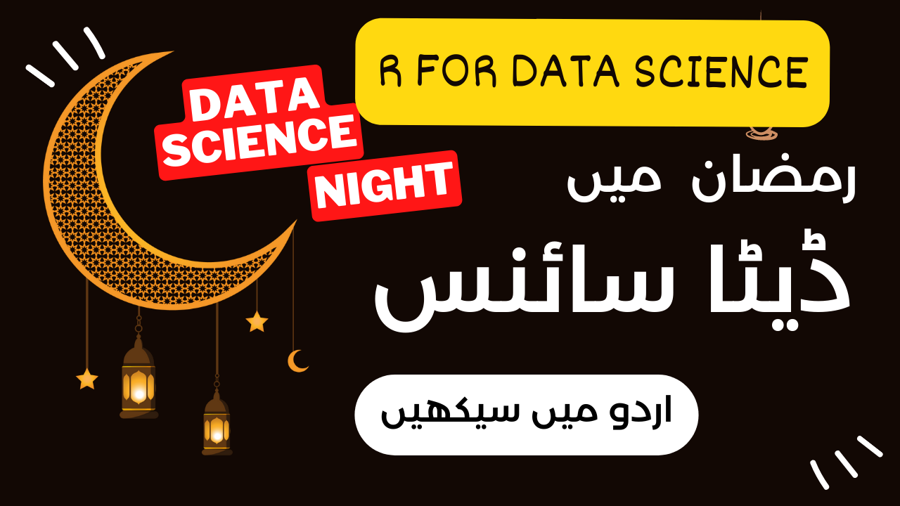](https://youtube.com/live/FcEiqKD8mXg "Lecture 32")

### **Lecture 33: Practice Python for Data Science pre-lecture given at the start of this course**

Is lecture ko complete kiay bina ap agay nahi chal saken gay is course ko start karne se pehlay ye 11 hours ka lectures zaroor sunen or practice karen, phir agay chalen, warna masla ho ga.

Pre-requisite lecture link is here:\
[](https://www.youtube.com/live/xjTMkxVSSxg?feature=share "Lecture 33")

>[Pre-requisite lecture link is here](https://www.youtube.com/live/xjTMkxVSSxg?feature=share)


### **Lecture 34: Start of Python for Data Science**

Here is the lecture on Python day 34:\
[](https://youtube.com/live/YcvZ6xV3hqI "Lecture 34")

### **Lecture 35: Python for Data Science Markdown Language in 72 minutes**

Here is the lecture on Python day 35:\
[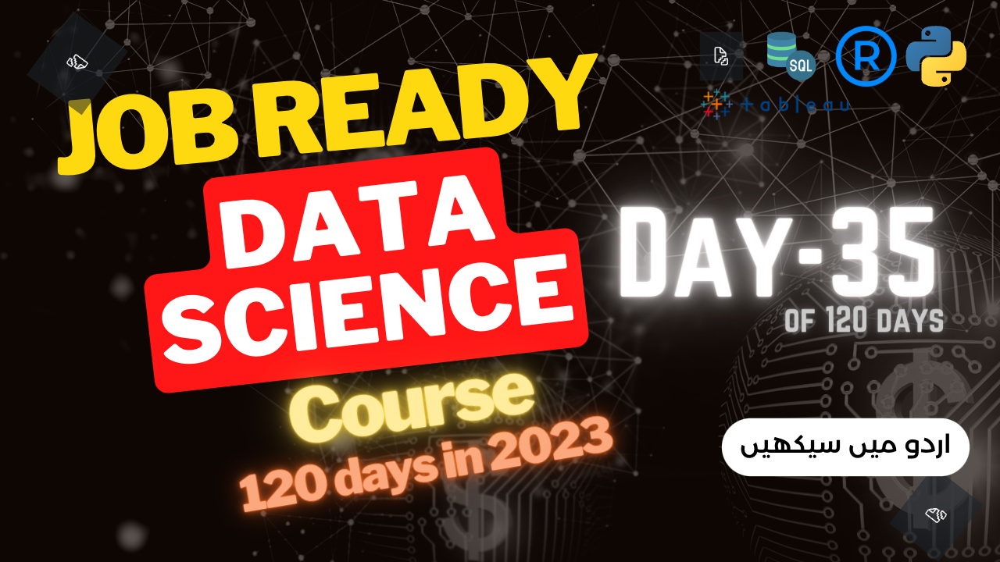]([link](https://youtu.be/qJqAXjz-Rh4?t=5) "Lecture 35")

### **Lecture 36: Python for Data Science basics**

Here is the lecture on Python day 36:\
[](https://www.youtube.com/live/VDIcwafn5x0?feature=share "Lecture 36")

### **Lecture 37: Data Night in Ramzan**

Here is the lecture on Data Night in Ramzan *3 hours long*:\
[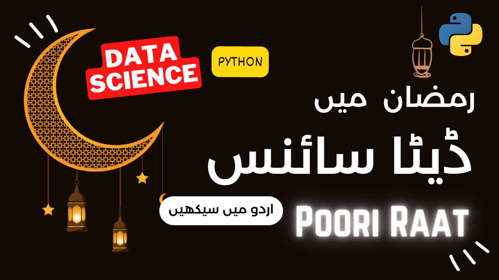](https://www.youtube.com/live/olFuszziFJY?feature=share "Lecture 37")

### **Lecture 38: Doing EDA in Python**

Exploratory data analysis is a very important part of data science. It is the process of analyzing the data to understand the data. It is also known as the exploratory data analysis or EDA, or `Data ko soonghna`. 

Steps of EDA in python:

1. Import the required libraries.
2. Import the dataset.
3. Understand the data.
4. Perform EDA.
5. Visualize the data.
7. Conclusion.

Itna b asan nahi hy, aaj k is lecture main ham aik dataset k oper EDA analysis karen gay.

Click here to watch the lecture:\
[](https://www.youtube.com/live/-hjdm00adeo?feature=share "EDA")

### **Lecture 39: EDA in Python on Big Dataset (1/4)**

Here is the lecture on EDA day 39:\
[](https://www.youtube.com/live/olFuszziFJY?feature=share "EDA Part 1")

### **Lecture 40: EDA in Python on Big Dataset (2/4)**

Here is the lecture on EDA day 40:\
[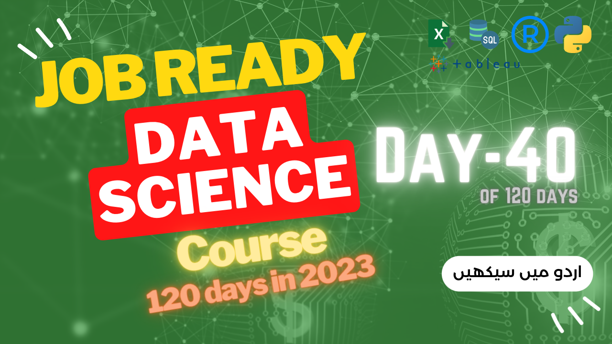](https://www.youtube.com/live/NZ62PzN434w?feature=share "EDA Part 2")

### **Lecture 41: EDA in Python on Big Dataset (3/4)**

Here is the lecture on EDA day 41:\
[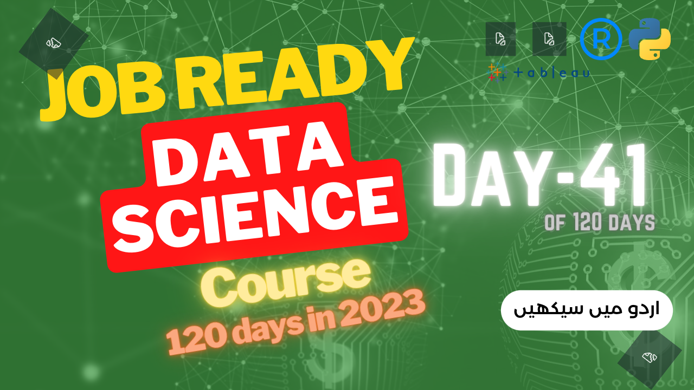](https://www.youtube.com/live/fr4mHOOZXsg?feature=share "EDA Part 3")

### **Lecture 42: EDA in Python on Big Dataset (4/4)**

Here is the lecture on EDA day 42:\
[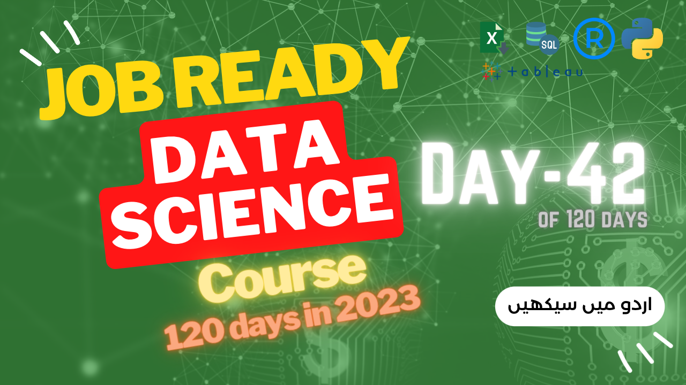](https://www.youtube.com/live/xWFf66lvagM?feature=share "EDA Part 4")

### **Lecture 43: EDA in Python (Practice Session)**

Practice EDA based on the [following notebook](https://www.kaggle.com/code/bextuychiev/my-6-part-powerful-eda-template) and watch [Lecture 43](#lecture-43-eda-in-python-practice-session).

### **Lecture 44: EDA in Python (Practice Session)**

Practice EDA based on the [following notebook](https://www.kaggle.com/code/bextuychiev/my-6-part-powerful-eda-template) and watch [Lecture 43](#lecture-43-eda-in-python-practice-session).

> Assignments: Use the following Datasets for your EDA:

1. [Goole App Store](https://www.kaggle.com/datasets/gauthamp10/google-playstore-apps/download?datasetVersionNumber=7)
2. [Apple Store](https://www.kaggle.com/gauthamp10/apple-appstore-apps)
3. [Android App Permission dataset](https://www.kaggle.com/gauthamp10/app-permissions-android)

and perform your EDA on two of the above mentioned, 1. is mandatory based on the lecture no. 43.

---
<div align="center" style="background-color:black; padding: 10px; color: yellow; font-size: 10px;">
  
# **Machine Learning**
  
</div>

---

Is section main ham machine learning seekhen gay, is section main total 37 lectures hyn, I hope ap is ko enjoy karne walay hy.

>Let's start with the first lecture of Machine Learning.

### **Lecture 01: Introduction to Machine learning**

Here is the lecture on Machine Learning day 01:\
[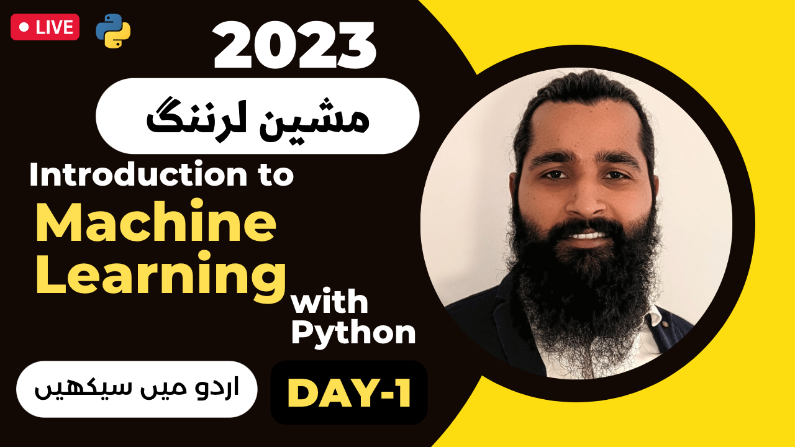](https://youtube.com/live/FCzeIGxwUI8?feature=share "Machine Learning")

### **Lecture 02: Regression vs. Classification**

Here is the lecture on Machine Learning day 02:\
[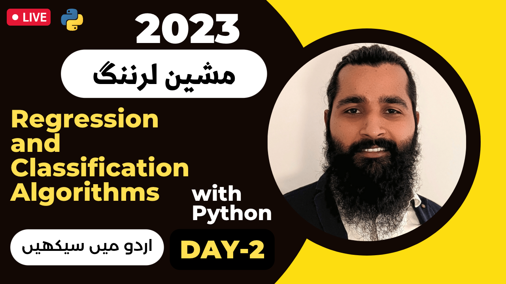](https://youtube.com/live/LCTJcCPh_Ao?feature=share "Machine Learning")

### **Lecture 03: Multilinear and Polynomial Regression**

Here is the lecture on Machine Learning day 03:\
[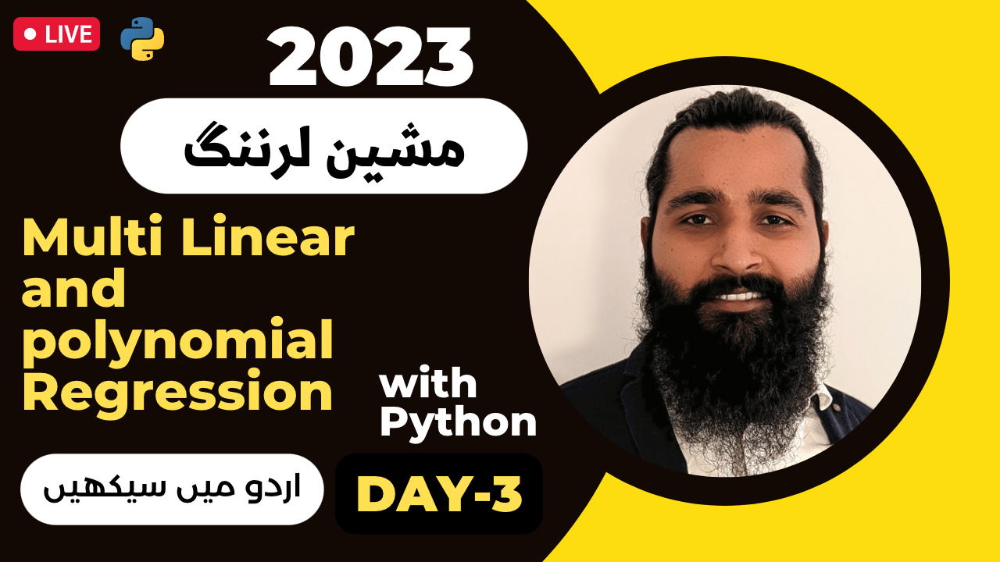](https://youtube.com/live/lOWj65bErRA?feature=share "Machine Learning")

### **Lecture 04: Logistic Regression Theory**

Here is the lecture on Machine Learning day 04:\
[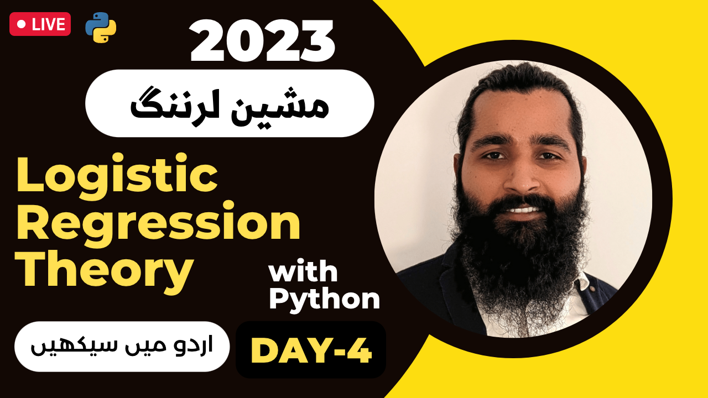](https://youtube.com/live/mT2N-LGp4-o?feature=share "Machine Learning")

### **Lecture 05: Logistic Regression in Python**

Here is the lecture on Machine Learning day 05:\
[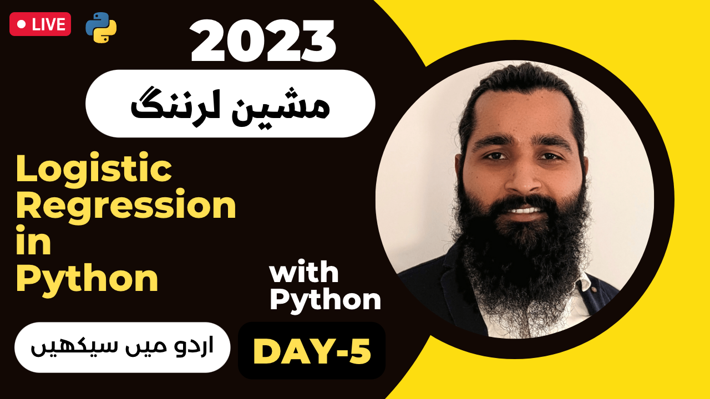](https://youtube.com/live/CzXt9tfI0Ok?feature=share "Machine Learning")

### **Lecture 06: Classification Metrics to evaluate models**

Here is the lecture on Machine Learning day 06:\
[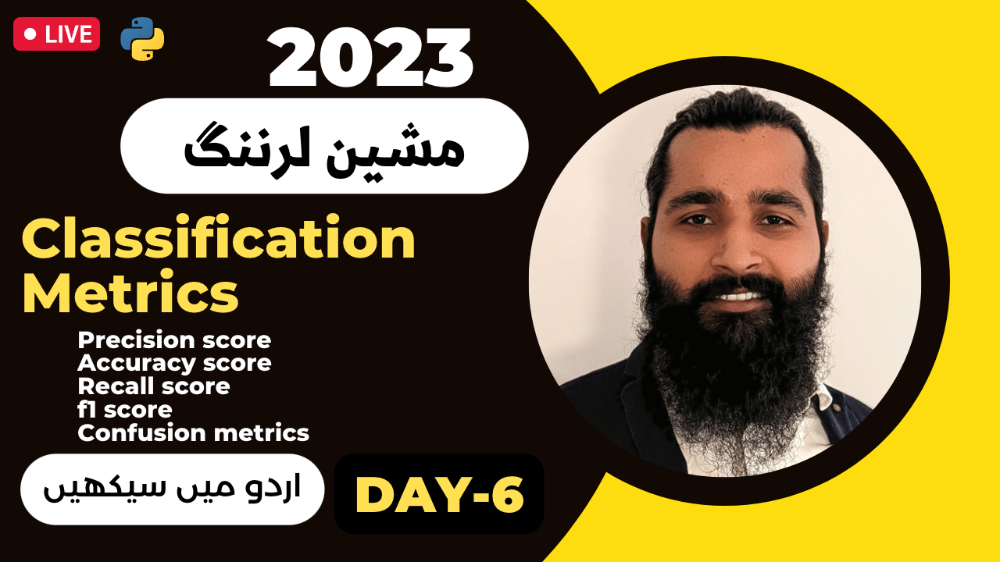](https://youtube.com/live/4ApRIPJhjn4?feature=share "Machine Learning")


### **Lecture 07: Support VEctor Machines (SVMs)**

Here is the lecture on Machine Learning day 07:\
[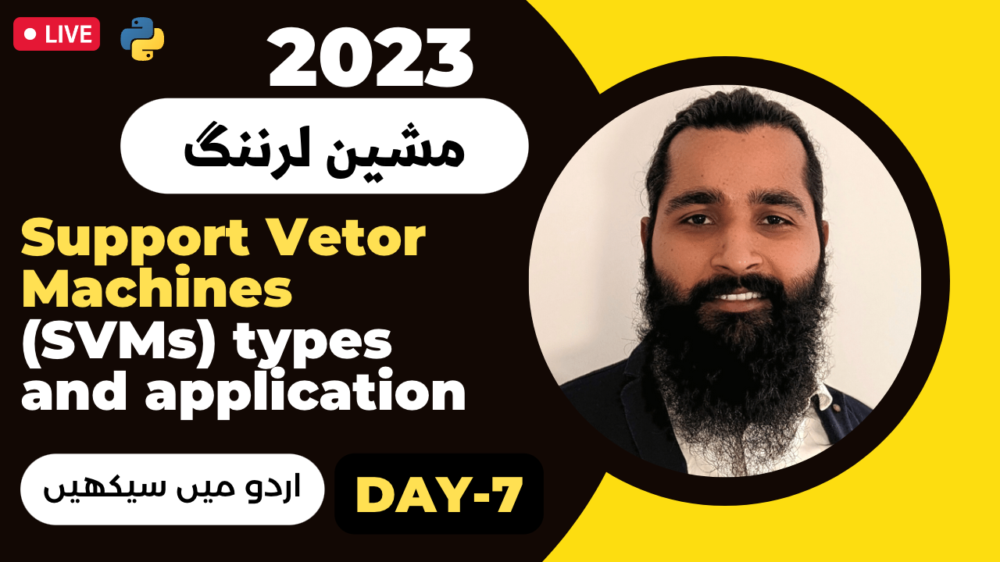](https://youtube.com/live/eBVCfu-eFXU?feature=share "Machine Learning")

### **Lecture 08: Naive Bayes**

Here is the lecture on Machine Learning day 08:\
[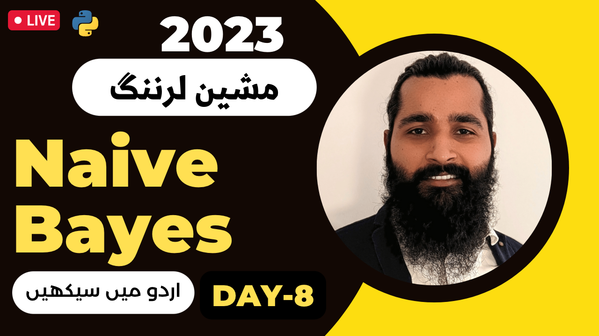](https://youtube.com/live/0bZ053kr-g8?feature=share "Machine Learning")

### **Lecture 09: Cross Validation Methdos in Machine Learning**

Here is the lecture on Machine Learning day 09:\
[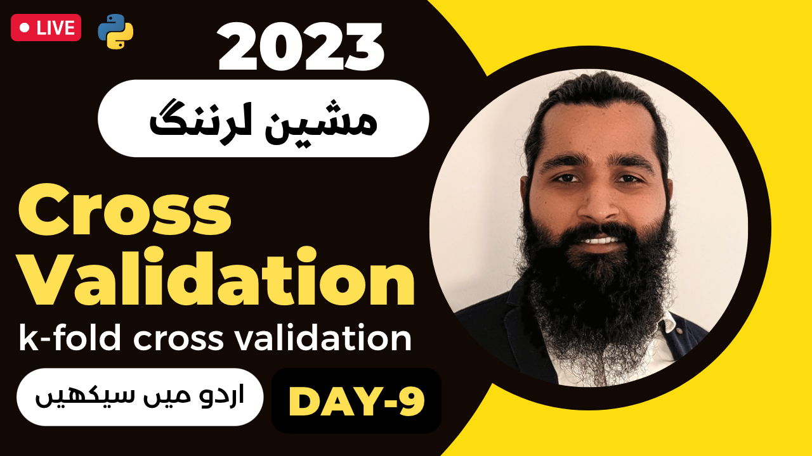](https://youtube.com/live/4s689_LyBHE?feature=share "Machine Learning")

### **Lecture 10: K nearest Neighbours (KNN)**

Here is the lecture on Machine Learning day 10:\
[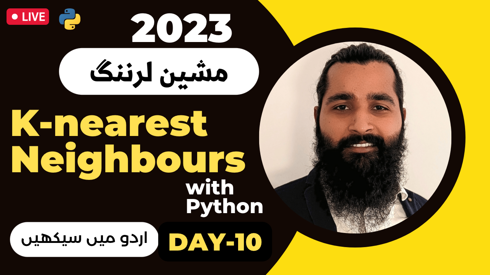](https://youtube.com/live/9HwFK7MTLi4?feature=share "Machine Learning")

### **Lecture 11: Mathematics behind K-nearest Neighbours (KNN)**

Here is the lecture on Machine Learning day 11:\
[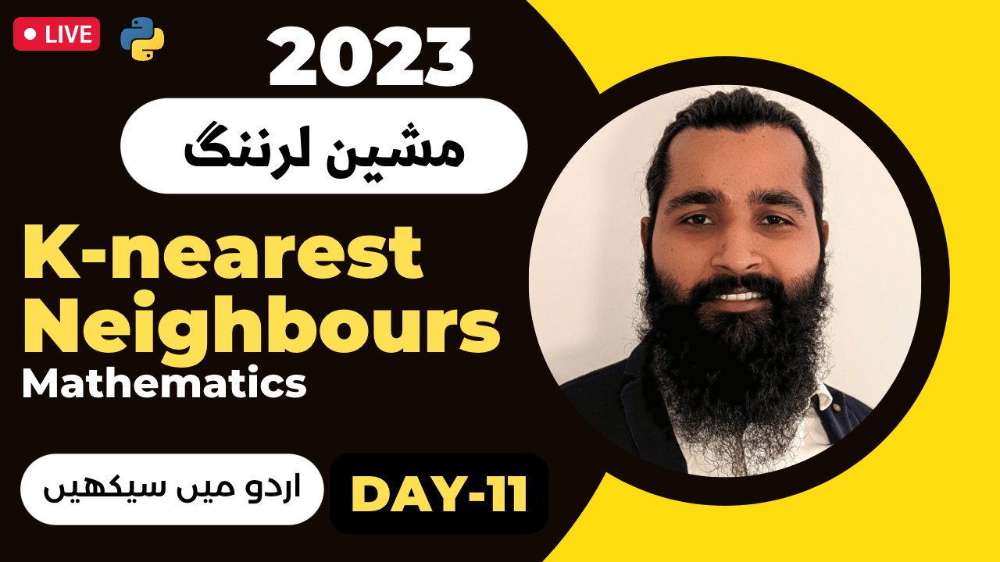](https://youtube.com/live/PK5zacJ7aEM?feature=share "Machine Learning")

### **Lecture 12: Missing or Null values Imputation**

This lecture is in two parts:

>#### **Lecture 12a: Missing or Null values Imputation**

Here is the lecture on Machine Learning day 12a:\
[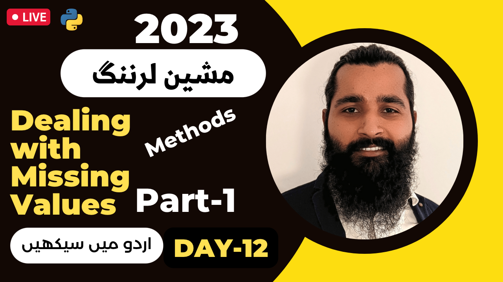](https://youtube.com/live/0nvXdHxVp6w?feature=share "Machine Learning")

>#### **Lecture 12b: Missing or Null values Imputation**

Here is the lecture on Machine Learning day 12b:\
[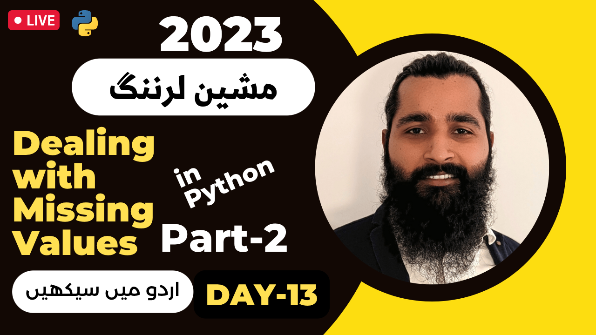](https://youtu.be/_LOUr71HKjo "Machine Learning")

### **Lecture 13: Pipeline and Hyperparameter Tuning in ML**

Here is the lecture on Machine Learning day 13:\
[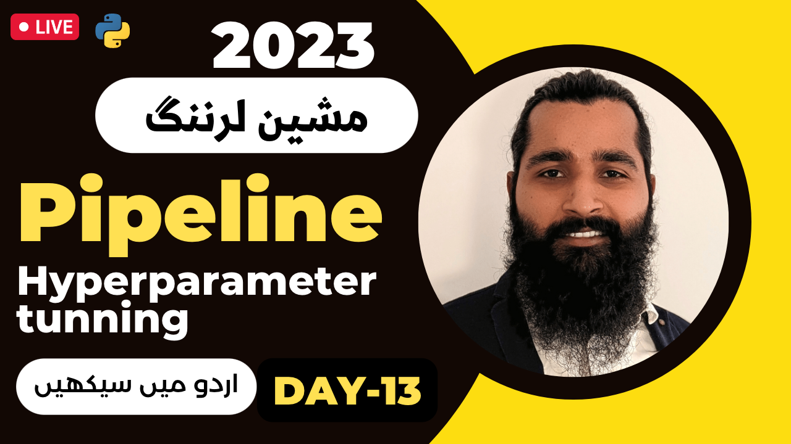](https://youtu.be/_OnBCg00SIM "Machine Learning")

### **Bonous Lecture: Data Science Portfolio with ChatGPT**

Here is the lecture:\
[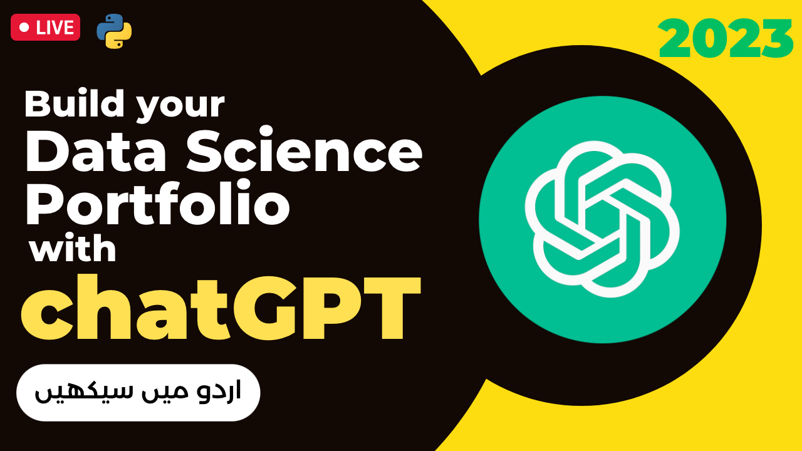](https://youtu.be/P55hrwSCUhQ "chatGPT and Data Science Portfolio")

### **Lecture 14: Decision Tree Algorithms**

We will discuss about the role of Decision trees in the following algorithms:
- ADAboost
- XGBoost
- Random Forest
- Gradient Boosting


More detailed lecture will br coming next in the following days/Lectures.

Here is the lecture on Machine Learning day 14:\
[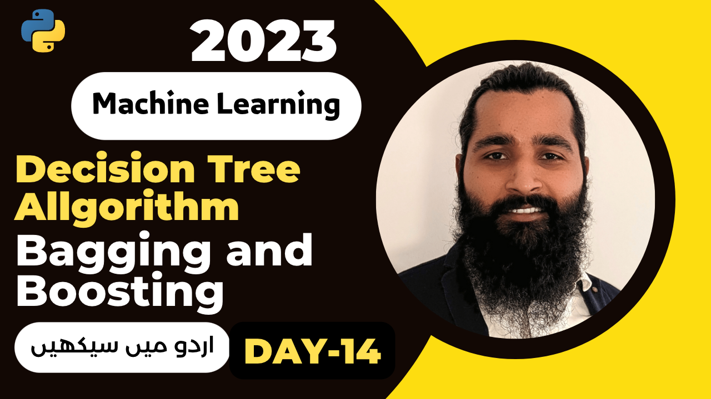](https://youtu.be/Jr0Yl2M_bn0 "Machine Learning")


The following blogs may help you further to understand the Decision Trees Ensemble Methods especially Bagging and Boosting concepts:

1. [The Ultimate Guide to AdaBoost, random forests and XGBoost](https://towardsdatascience.com/the-ultimate-guide-to-adaboost-random-forests-and-xgboost-7f9327061c4f)
2. [Ensemble methods: bagging, boosting and stacking](https://towardsdatascience.com/ensemble-methods-bagging-boosting-and-stacking-c9214a10a205)

### **Lecture 15: Decision Tree Algorithm practice in Python with sk-learn**

Here is the lecture on Machine Learning day 15:\
[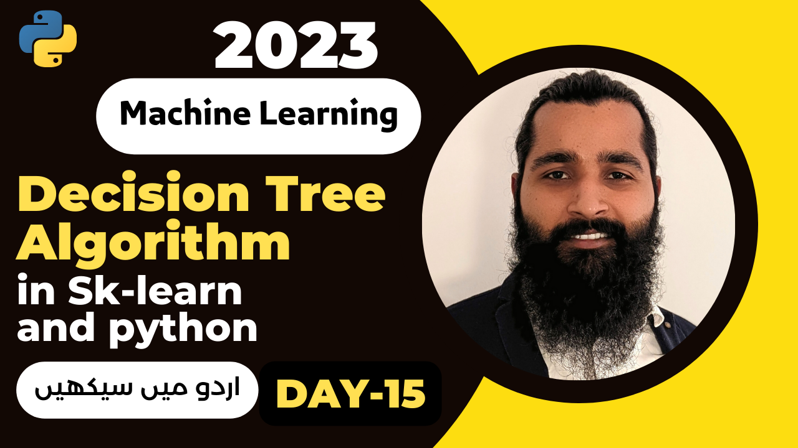](https://youtu.be/ZeImGBZjFuA "Machine Learning")

### **Lecture 16: ADA-booost**

Here is the lecture on Machine Learning day 16:\
[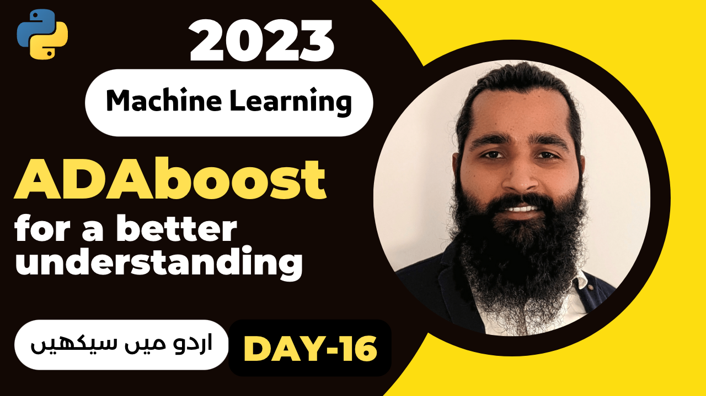](https://youtu.be/DkdDH60Mfqs "Machine Learning")

### **Lecture 17: Random Forest**

Here is the lecture on Machine Learning day 17:\
[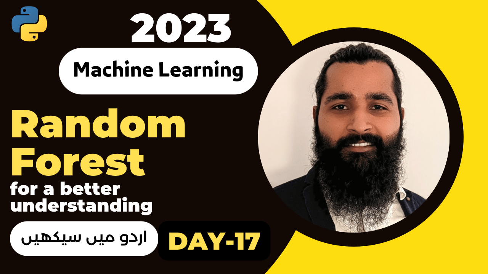](https://youtu.be/cEMqk9JHLkU "Machine Learning")

### **Lecture 18: XGBoost, CATBoost, lightGBM**

Here is the lecture on Machine Learning day 18:\
[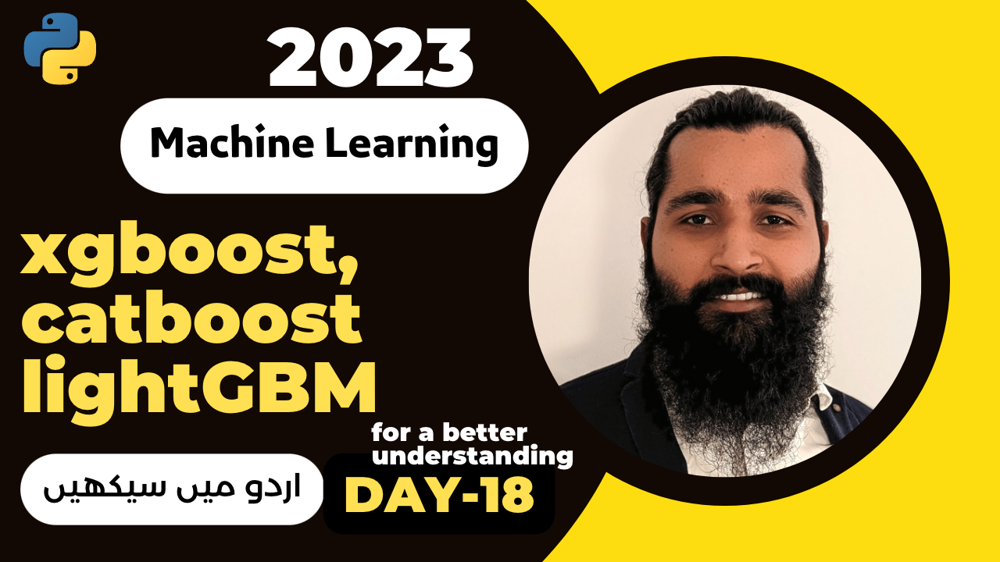](https://youtu.be/HIZNPB3sMNI "Machine Learning")

### **Lecture 19: Regularization Lasso (L1) and Ridge (L2) | A beginner guide**

Here is the lecture on Machine Learning day 19:\
[](https://youtu.be/sPZ0V1VrjU4 "Machine Learning")

### **Lecture 20: Ensemble Algorithms in python**

Here is the lecture on Machine Learning day 20:\
[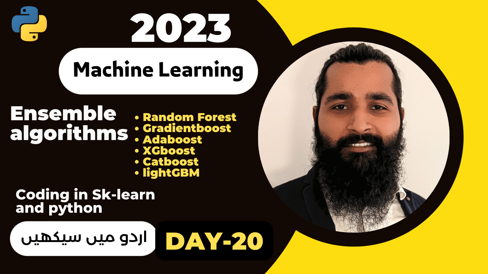](https://youtu.be/9AbN0TImAh0 "Machine Learning")

### **Lecture 21: Selecting a Best Model with Hyperparameter tuning**

Here is the lecture on Machine Learning day 21:\
[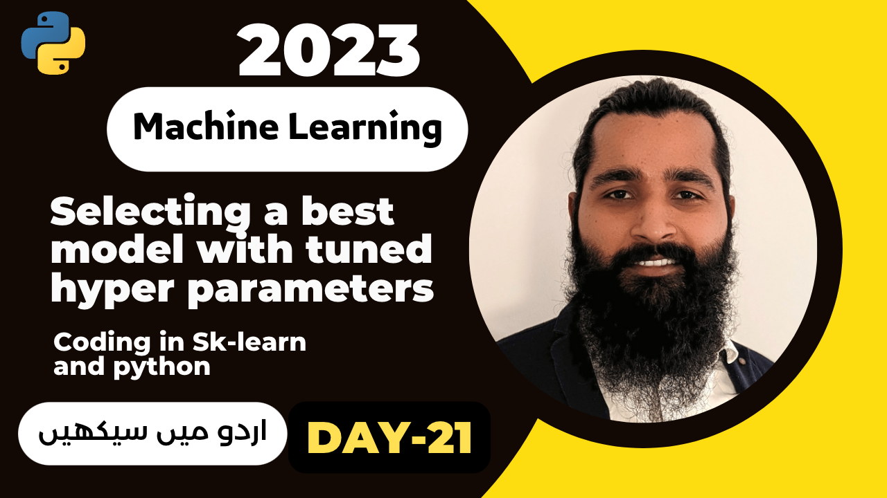](https://youtu.be/6SN91m9E4vI "Machine Learning")

### **Lecture 22: Unsupervised Machine Learning Algorithms**

Here is the lecture on Machine Learning day 22:\
[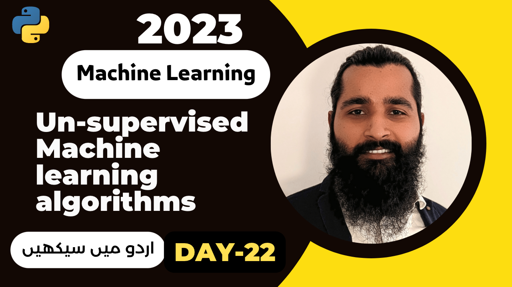](https://youtu.be/Ht7kUMbeyXc "Machine Learning")

### **Lecture 23: Clustering Algorithms**

Here is the lecture on Machine Learning day 23:\
[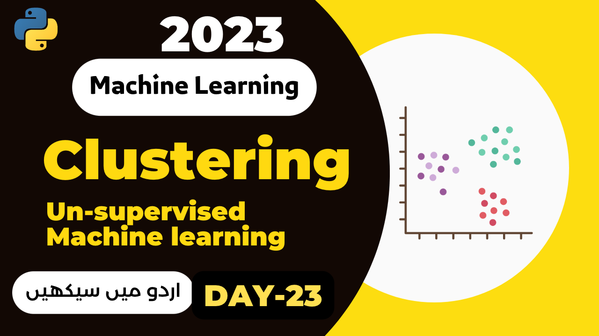](https://youtu.be/RiiJ7Rtoc08 "Machine Learning")

### **Lecture 24: K-means Clustering**

Here is the lecture on Machine Learning day 24:\
[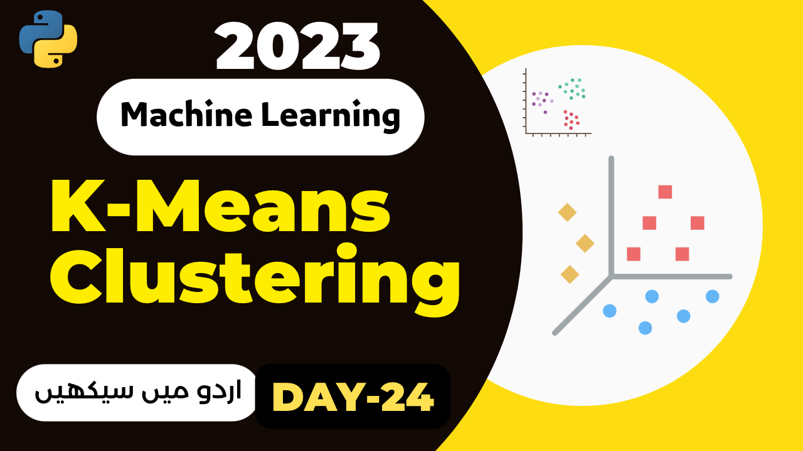](https://youtu.be/CI4en5k966A "Machine Learning")

### **Lecture 25: kmeans vs. kmeans++ Clustering**

Here is the lecture on Machine Learning day 25:\
[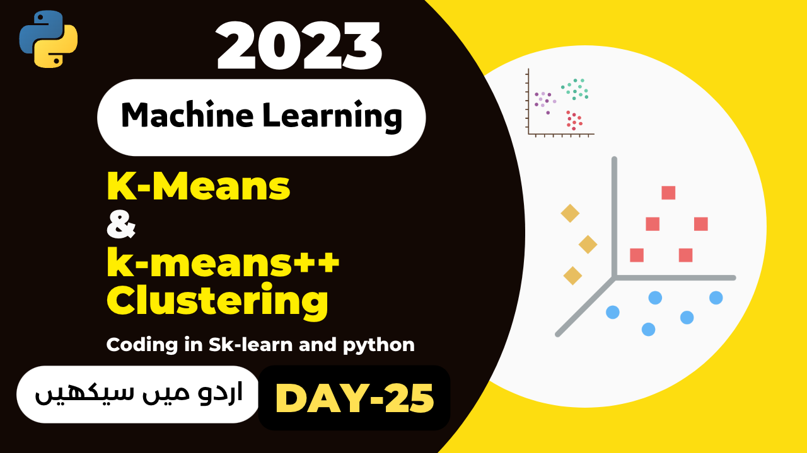](https://youtu.be/OuHS9xa6nhU "Machine Learning")

### **Lecture 26: Hierarchical Clustering Theory**

Here is the lecture on Machine Learning day 26:\
[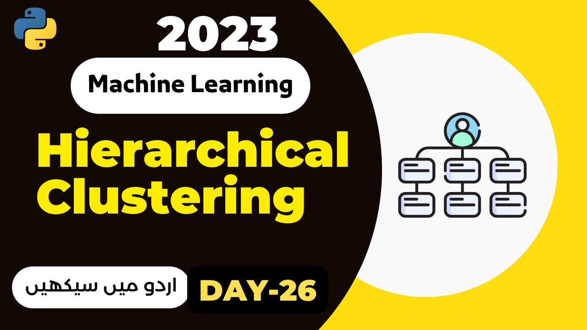](https://youtu.be/gA0jOzoub-A "Machine Learning")

### **Lecture 27: Hierarchical Clustering Practice in Python**

Here is the lecture on Machine Learning day 27:\
[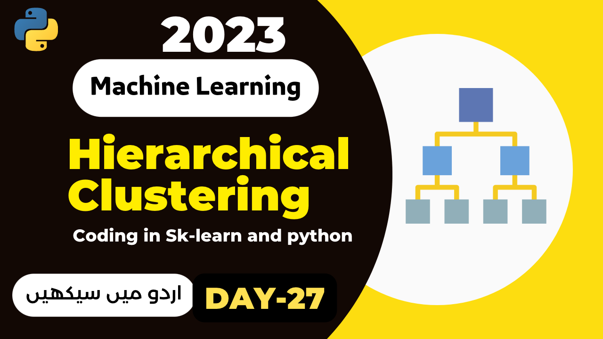](https://youtu.be/PVyILZow2Y4 "Machine Learning")

### **Lecture 28: DBSCAN (Density-based spatial clustering of applications with noise)**

Here is the lecture on Machine Learning day 28:\
[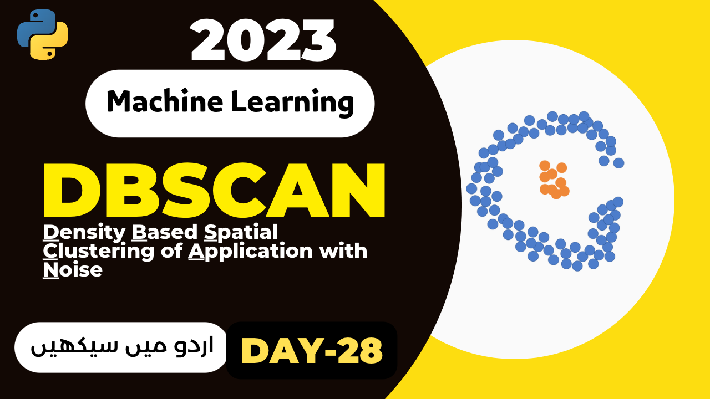](https://youtu.be/CUYHctYWbhQ "Machine Learning")

This blog may help you further to understand the DBSCAN algorithm:
> [Density Based Algorithms](https://towardsdatascience.com/density-based-algorithms-49237773c73b)

### **Lecture 29: DBSCAN vs. OPTICS**

OPTICS: Ordering points to identify the clustering structure

DBSCAN: Density-based spatial clustering of applications with noise

Here is the lecture on Machine Learning day 29:\
[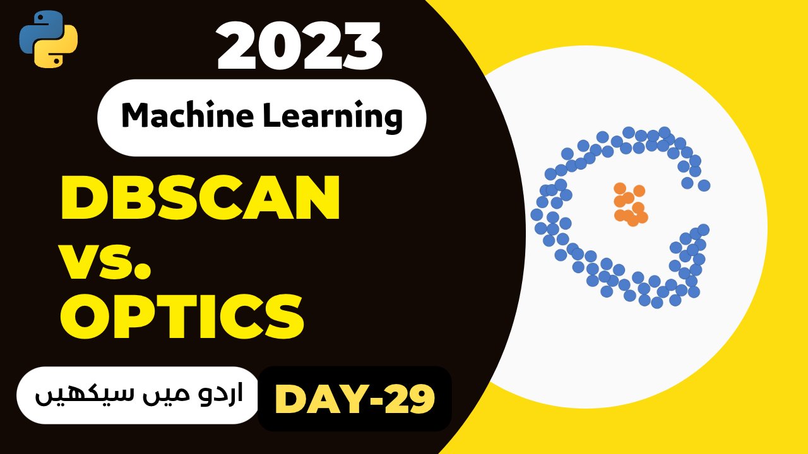](https://youtu.be/i8Mb3aAhYSg "Machine Learning")

This blog may help you further to understand the DBSCAN algorithm:
> [OPTICS Clustering Explanation](https://www.geeksforgeeks.org/ml-optics-clustering-explanation/)
> [Optics in Python](https://pub.towardsai.net/fully-explained-optics-clustering-with-python-example-4553108fa04b)

### **Lecture 30: Gaussian Mixture Models (GMM)**

Here is the lecture on Machine Learning day 30:\
[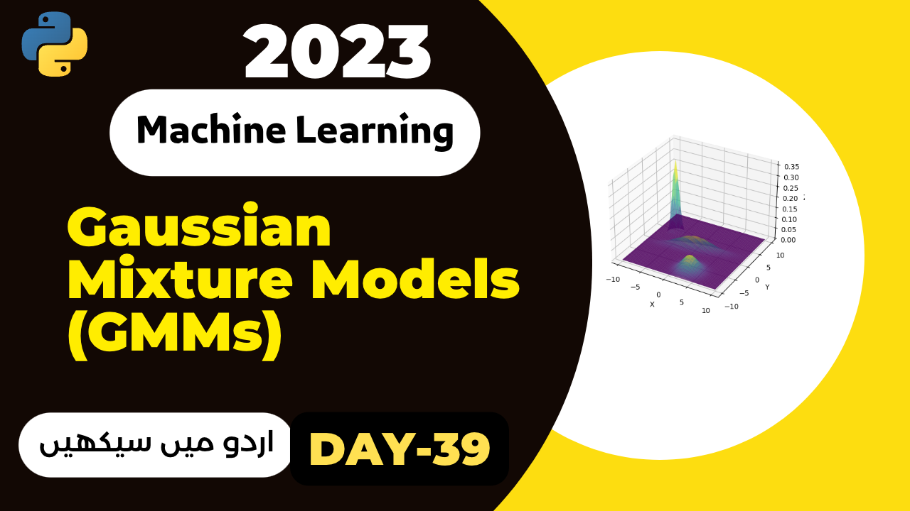](https://youtu.be/fQkKdl6i2no "Machine Learning")

This blog may help you further to understand the DBSCAN algorithm:
> [Gaussian Mixture Models Explained](https://towardsdatascience.com/gaussian-mixture-models-explained-6986aaf5a95)


### **Lecture 31: Evaluation metrics for GMM**

Here is the lecture on Machine Learning day 31:\
[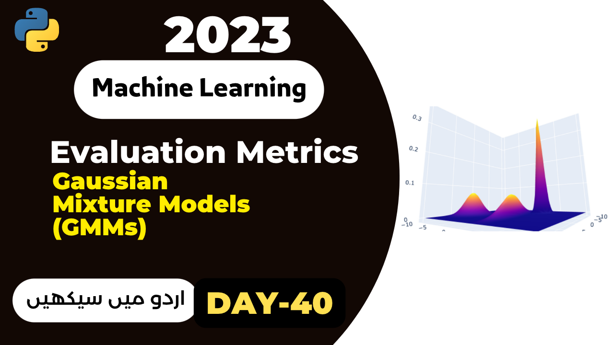](https://youtu.be/8MGkyNYT97A "Machine Learning")

### **Lecture 32: Feature Engineering**

Here is the lecture on Machine Learning day 32:\
[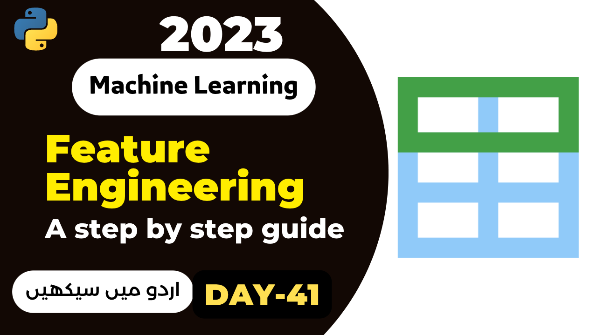](https://youtu.be/0Y4zGbv8GuE "Machine Learning")

### **Lecture 33: Feature Selection**

Here is the lecture on Machine Learning day 33:\
[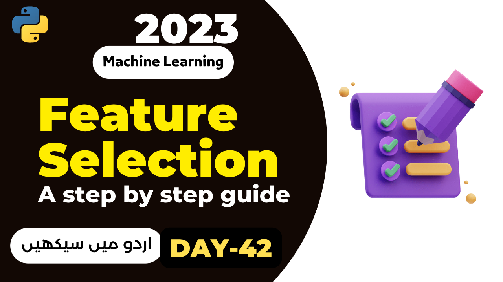](https://youtu.be/LEcd-0V0vSs "Machine Learning")

### **Lecture 34: Principal Component Analysis (PCA)**

This lecture is in two parts:

>#### **Lecture 34a: Principal Component Analysis (PCA) Theory**

Here is the lecture on Machine Learning day 34a:\
[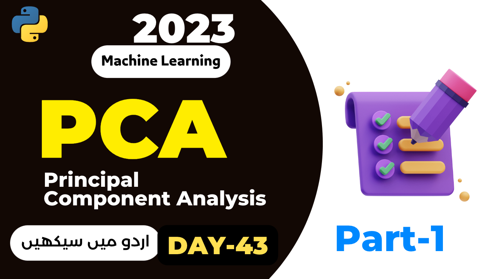](https://youtu.be/7sfNUKsvjGM "Machine Learning")

>#### **Lecture 34b: Principal Component Analysis (PCA) Practice and Interpretation**

Here is the lecture on Machine Learning day 34b:\
[](https://youtu.be/lYasC4DsKF0 "Machine Learning")

### **Lecture 35: SVD (Singular Value Decomposition)**

Here is the lecture on Machine Learning day 35:\
[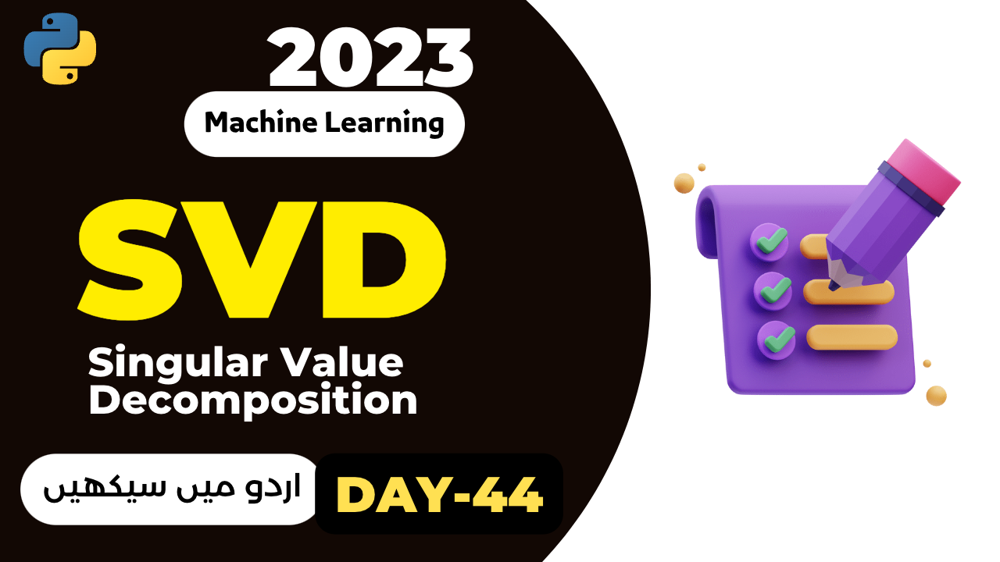](https://youtu.be/CjmBeepgnYg "Machine Learning")

### **Lecture 36: tSNE (t-distributed Stochastic Neighbor Embedding)**

Here is the lecture on Machine Learning day 36:\
[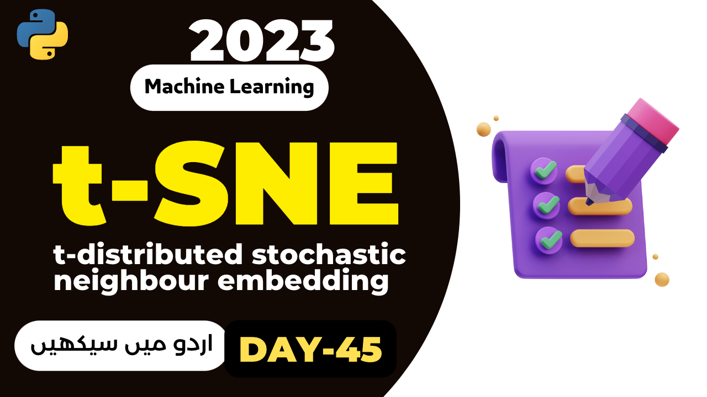](https://youtu.be/3YDSfaXqY3U "Machine Learning")

----
> Great! You have a done a good job by learning Machine Learning concepts and Coding in Python. As a small token, here are two bonus lecture:
> 
### **Google Colab use, tips and tricks**

Here is the lecture on Machine Learning day 37:\
[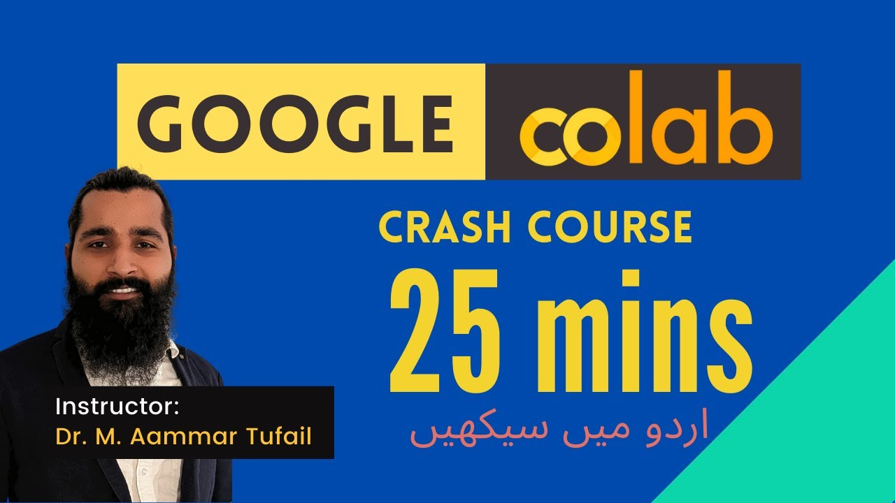](https://youtu.be/NAvWmSTH9WA "Machine Learning")

### **Miconda and Conda Environments for Effiecint use of ML models**

Here is the lecture on Machine Learning day 38:\
[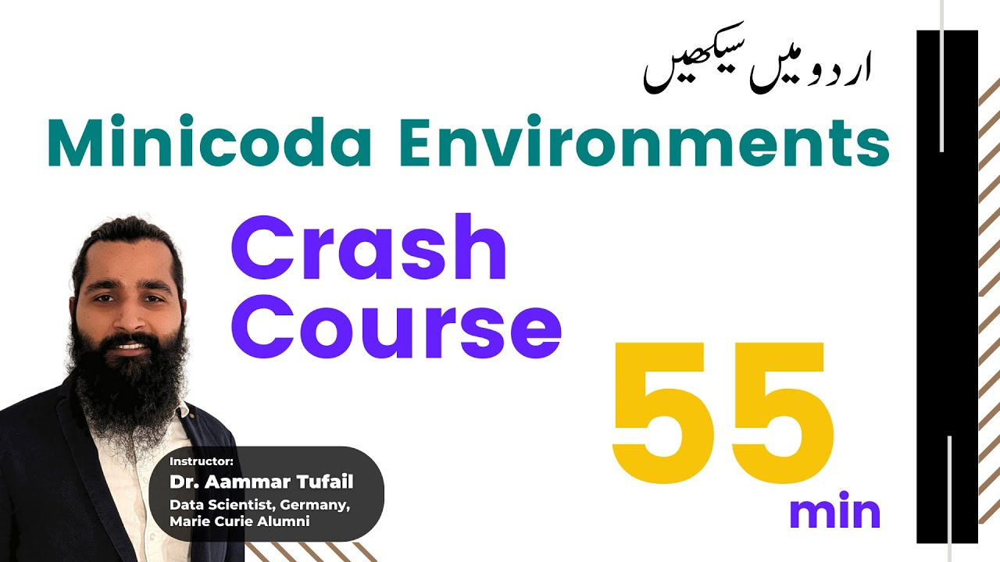](https://youtu.be/nsFdTgwDrVEmSTH9WA "Machine Learning")

> Now, let's move to the Deep Learning Section.

---
<div align="center" style="background-color:black; padding: 10px; color: yellow; font-size: 10px;">
  
# **Deep Learning**
  
</div>
---

### **Lecture 01: Introduction to Deep Learning (DL-101)**

Here is the lecture on Deep Learning day 01:\
[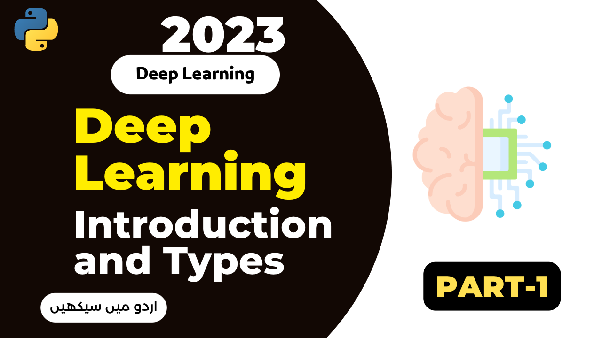](https://youtu.be/LnbQCSZz3_k "Deep Learning")

### **Lecture 02: What is Neural Network? and How we can construct it**

Here is the lecture on Deep Learning day 02:\
[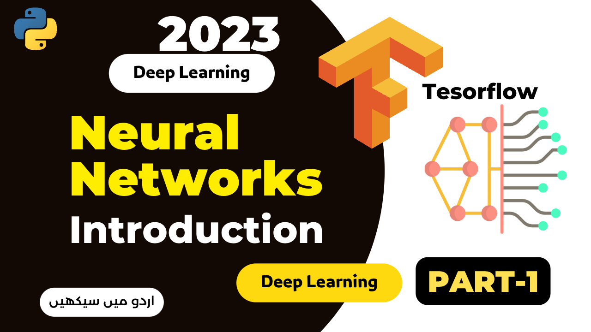](https://youtu.be/4UB8dyjuO8s "Deep Learning")

### **Lecture 03: Number of neurons in Each Layer**

Here is the lecture on Deep Learning day 03:\
[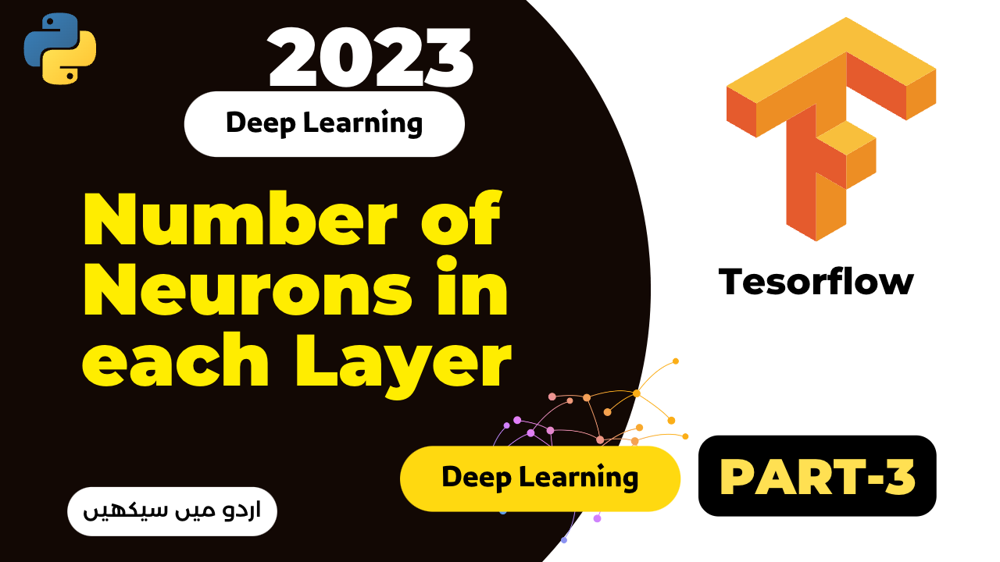](https://youtu.be/3ZA5rdJ_ilg "Deep Learning")

### **Lecture 04: Computer Vision (Basics)**

Here is the lecture on Deep Learning day 04:\
[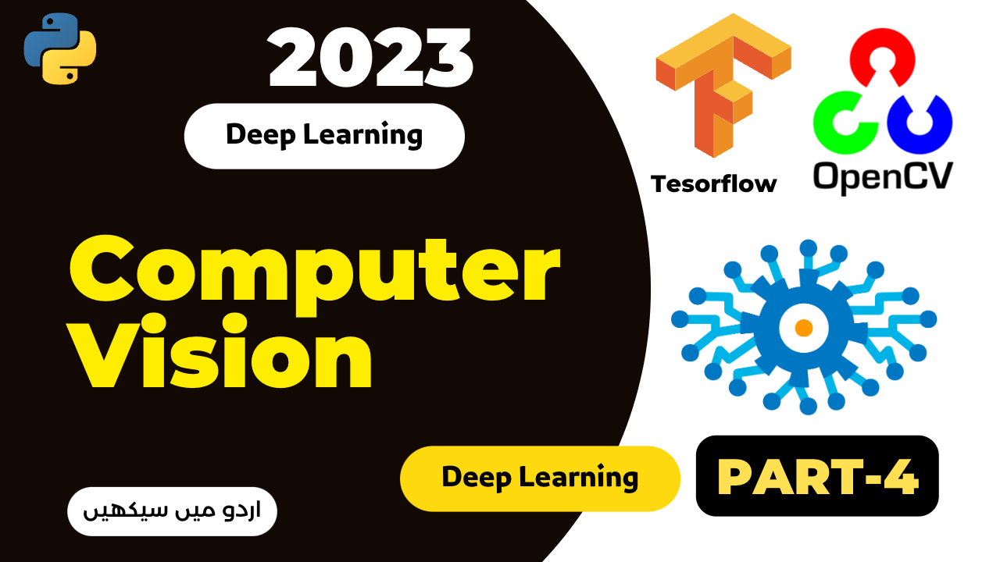](https://youtu.be/TWhR_8JjDwU "Deep Learning")

### **Lecture 05: Deep Learning and Computer Vision**

Here is the lecture on Deep Learning day 05:\
[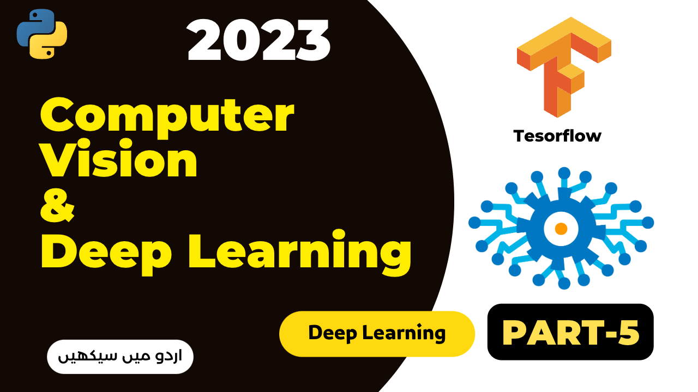](https://youtu.be/_qhqPW-7Rgs "Deep Learning")

### **Lecture 06: Activation Functions**

This is a deatiled 3 parts lecture on activation functions, we will discuss the following activation functions in this lecture:


1. Linear: 📈
2. Binary Step: ⬆️⬇️
3. Sigmoid: 🔘
4. Tanh: 📈🔘📉
5. ReLU: ⚡️
6. Leaky ReLU: ⚡️💧
7. Parametric ReLU: ⚡️🔑
8. Softmax: 🌟
9. Exponential Linear Unit (ELU): ⚡️📈
10. swish: ⚡️🔘

Here is the lecture on Deep Learning day 06:\
[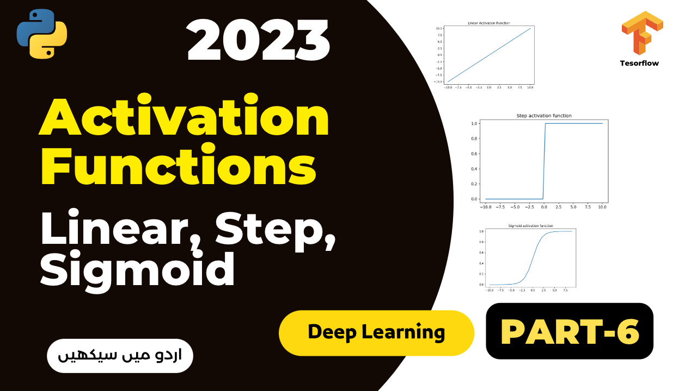](https://youtu.be/R45Su8qB4vk "Deep Learning")

### **Lecture 07: Activation Functions**

Here is the lecture on Deep Learning day 07:\
[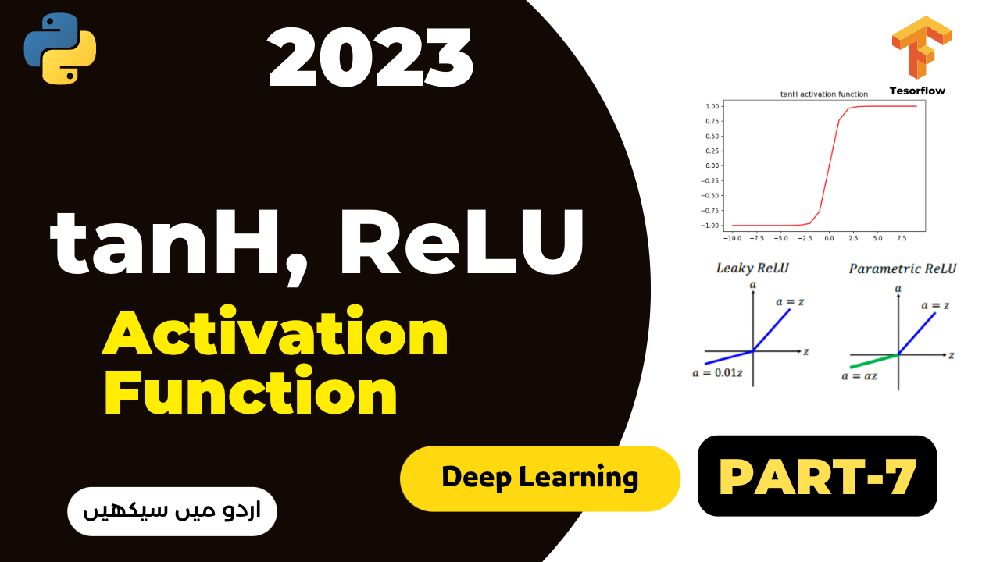](https://youtu.be/j7eFGzL1L14 "Deep Learning")

### **Lecture 08: Activation Functions**

Here is the lecture on Deep Learning day 08:\
[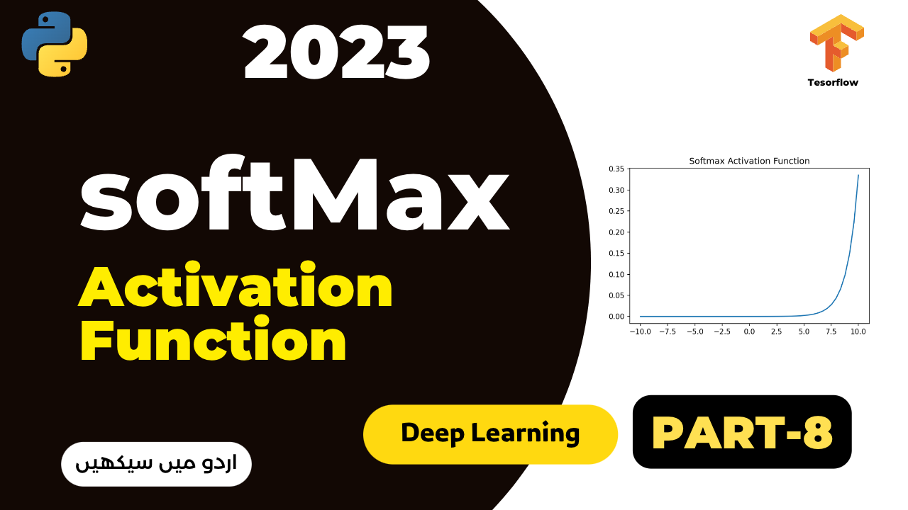](https://youtu.be/c97dhwlHu68 "Deep Learning")

### **Lecture 09: How to choose an activation functions**

Here is the lecture on Deep Learning day 09:\
[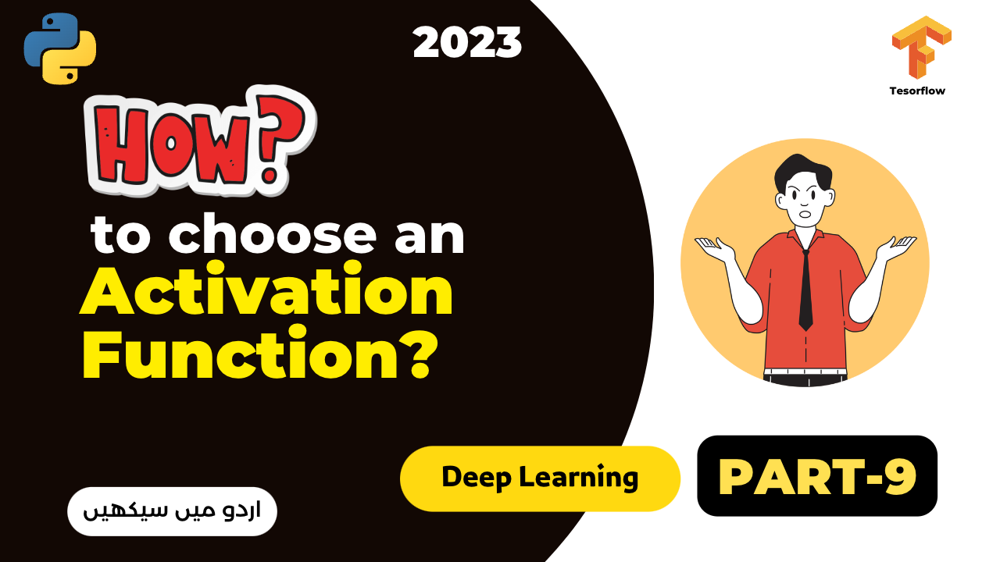](https://youtu.be/q1cVPzlH280 "Deep Learning")

### **Lecture 10: Regression with Artificial Neural Network (ANN)**

Here is the lecture on Deep Learning day 10:\
[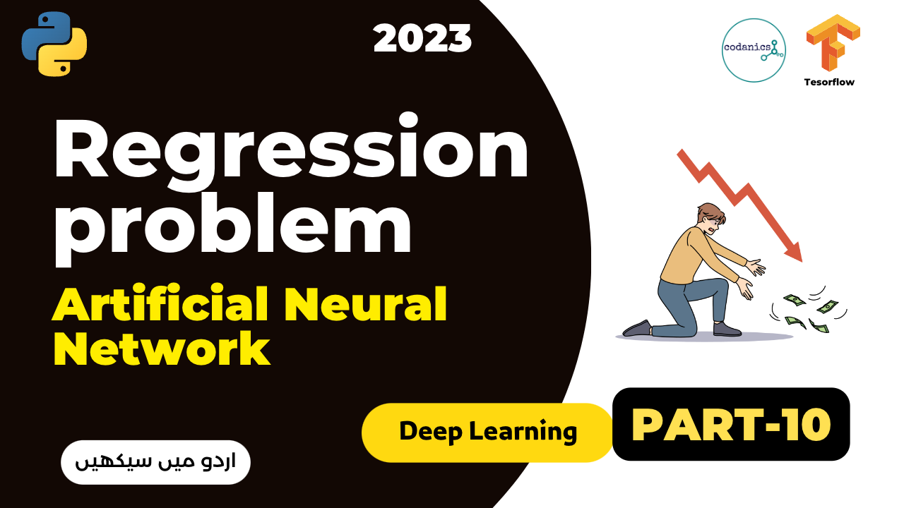](https://youtu.be/mESqyC0sHMQ "Deep Learning")

### **Lecture 11: Test, training, validation loss in Artificial Neural Network (ANN)**

Here is the lecture on Deep Learning day 11:\
[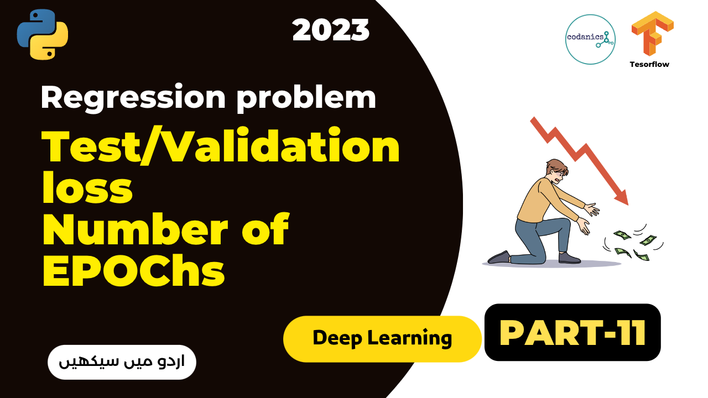](https://youtu.be/pCNa0Rm7Ftk "Deep Learning")

> Great! You have done a great job in learning Deep Learning. As a token of appreciation, here you have two bonus lectures to increase your skillset.

### **Bonus Lecture: gitHUB copilotX**

Here is the lecture on github copilotX:\
[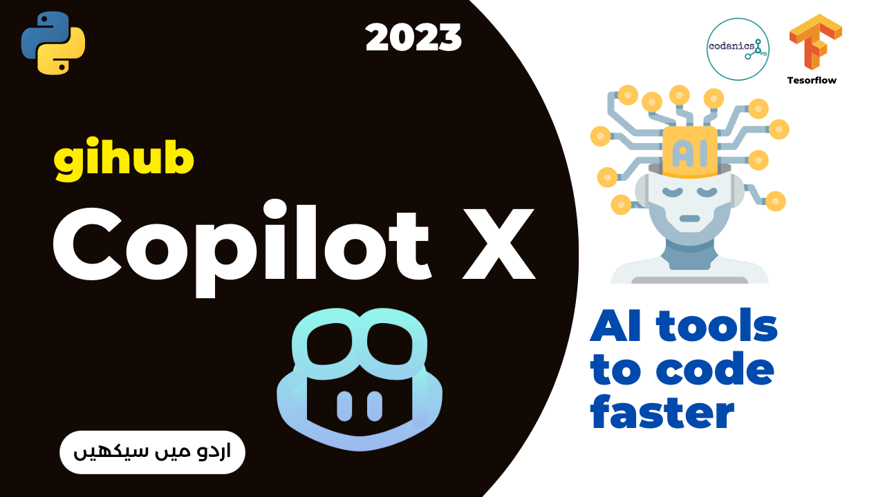](https://youtu.be/URz60dWct7U "Deep Learning")

### **Bonus Lecture: How to find big Datasets for you Data science, Machine Learning or Deep Learning portfolio?**

Here is the lecture on Finding Big Datasets:\
[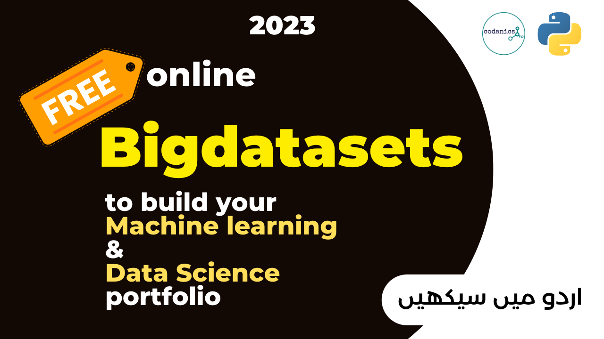](https://youtu.be/Z4P0ao_nmio "Deep Learning")


### **Lecture 12: Convolutional Neural Network (CNN) Theory**

Here is the lecture on CNN:\
[](https://youtu.be/N7eD14XuNFQ "Deep Learning")

### **Lecture 13: Convolutional Neural Network (CNN) Practice in Python | Tensorflow framework**

Here is the lecture on CNN:\
[](https://youtu.be/NReTiAnPtG4 "Deep Learning")

### **Lecture 14: Master Convolutional Neural Network (CNN)Concepts to make projects**

Here is the lecture on CNN:\
[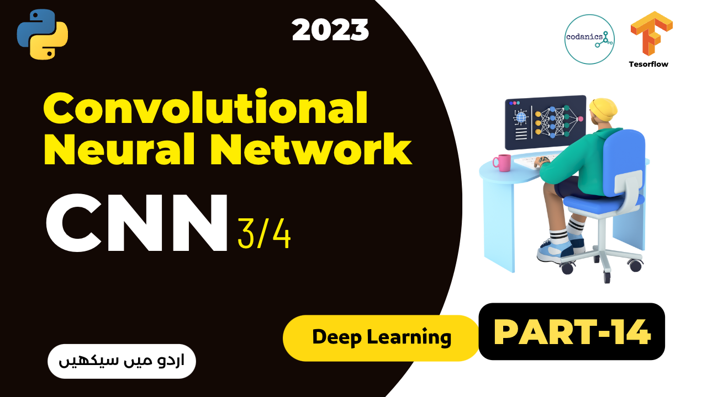](https://youtu.be/u9AgFxP9D_Y "Deep Learning")

### **Lecture 15: Recurrent Neural Network (RNN) Theory**

Here is the lecture on RNN:\
[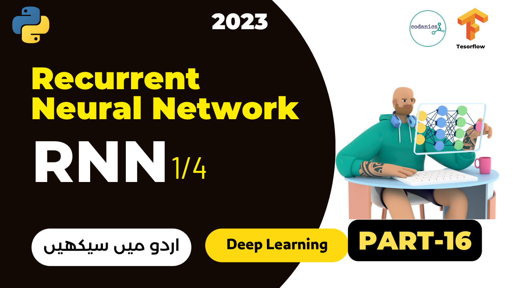](https://youtu.be/hkC7_vaVHos "Deep Learning")

### **Lecture 16: Recurrent Neural Network (RNN) Practice in Python | Tensorflow framework**

Here is the lecture on RNN:\
[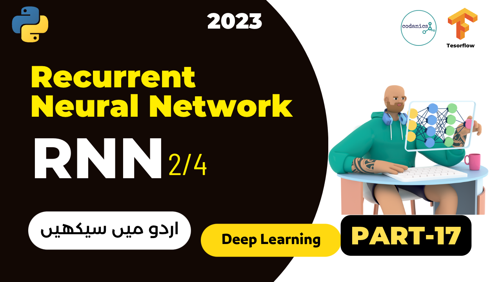](https://youtu.be/dDH_o3qWupQ "Deep Learning")

### **Lecture 17: NLP with RNN**

NLP (Natural Language Processing) is a very important part of Deep Learning, in this lecture we will discuss NLP with RNN.

Here is the lecture on NLP with RNN:\
[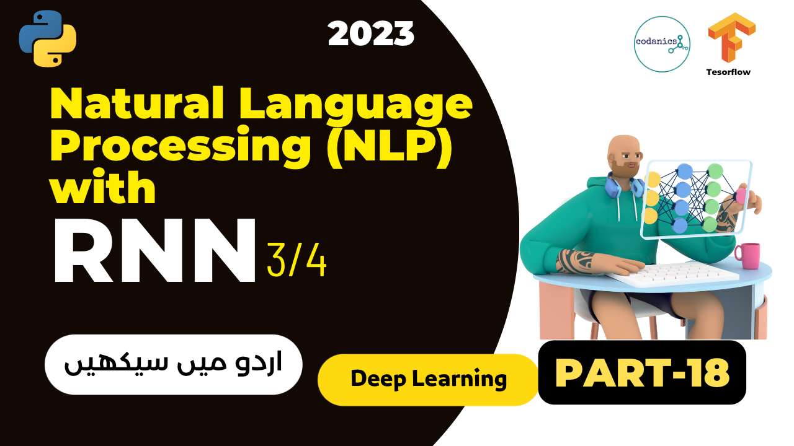](https://youtube.com/live/7sr8KgtyR0o?feature=share "Deep Learning")

### **Lecture 18: Key Terms to be used in NLP**

Here is the lecture on NLP Key Terms:\
[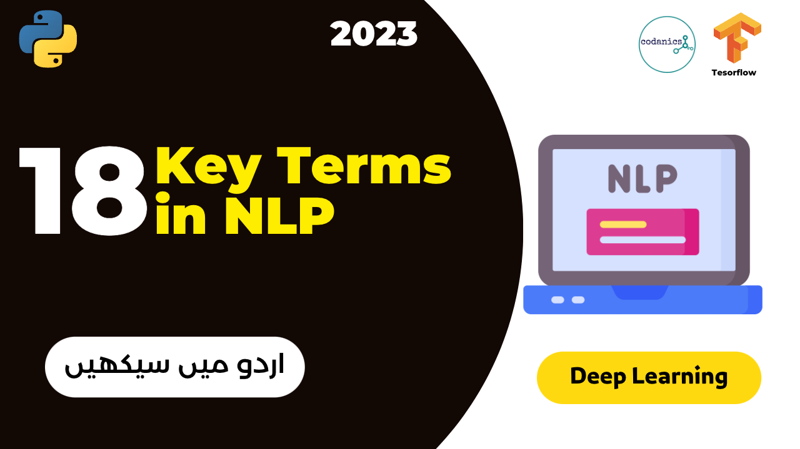](https://youtu.be/aN3BI181r2Q "Deep Learning")

### **Lecture 19: Sentiment Anlysis using RNN**

Here is the lecture on Sentiment Analysis:\
[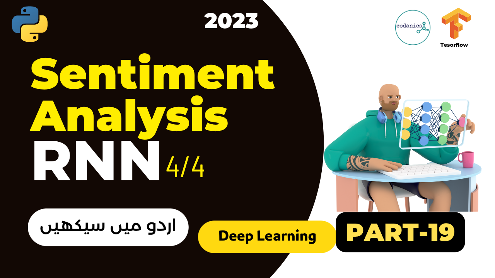](https://youtu.be/aKQXtZcAldo "Deep Learning")

### **Lecture 20: LSTM (Long Short Term Memory) Theory for NLP in Python**

Here is the lecture on LSTM:\
[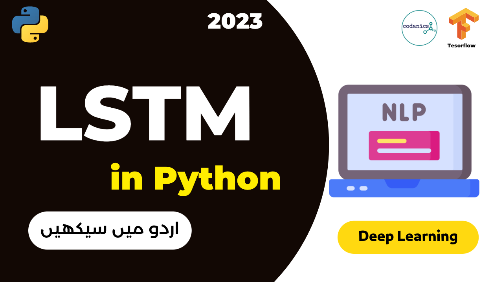](https://youtu.be/fvnoVGLtS0k "Deep Learning")

### **Lecture 21: Fastest way to make notebooks for your portfolio using gitHub copilotX**

Here is the lecture on gitHub copilotX:\
[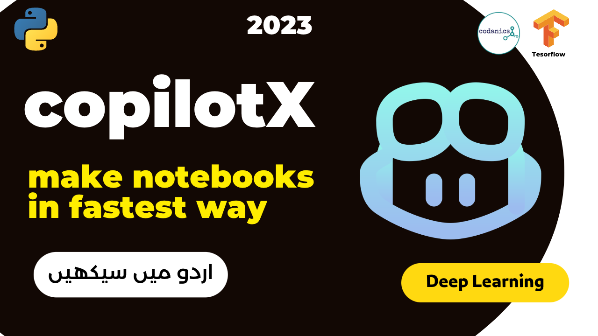](https://youtu.be/cLnyoLp6o9g "Deep Learning")

### **Lecture 22: Key DIfferences: ANN vs. CNN vs. RNN vs. LSTM vs. GRU**

ANN (Artificial Neural Network) vs. CNN (Convolutional Neural Network) vs. RNN (Recurrent Neural Network) vs. LSTM (Long Short Term Memory) vs. GRU (Gated Recurrent Unit)

Here is the lecture on Key Differences:\
[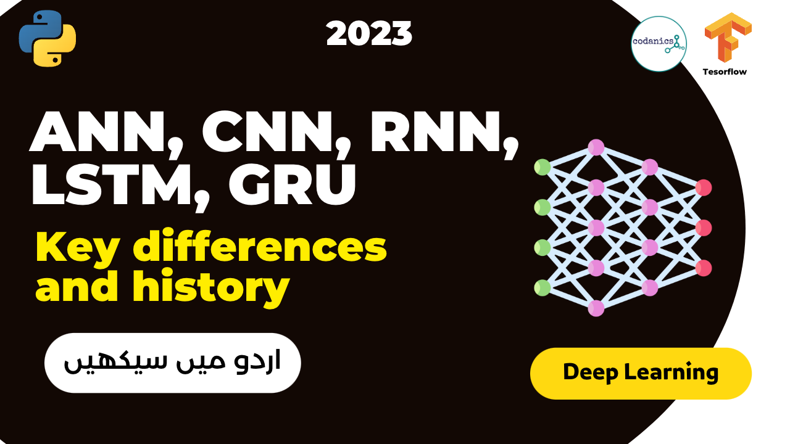](https://youtu.be/CJDFNh5l_Ls "Deep Learning")

### **Lecture 23: LSTM vs. GRU**

LSTM (Long Short Term Memory) vs. GRU (Gated Recurrent Unit). 
Here are the key differences between LSTM and GRU:

* LSTM has 3 gates (input, output, and forget), while GRU has 2 gates (reset and update).
* LSTM has 1 memory cell, while GRU has 1 gate that controls the flow of information.
* LSTM has 1 output, while GRU has 2 outputs (hidden state and output).
* LSTM has 1 forget gate, while GRU has 1 reset gate.
* LSTM has 1 input gate, while GRU has 1 update gate.
* 
Overall, both `LSTM` and `GRU` are types of recurrent neural networks that are used for sequence modeling. LSTM is more complex and has more gates, which allows it to capture longer-term dependencies in the data. GRU is simpler and has fewer parameters, which makes it faster to train and less prone to overfitting.

Here is the lecture on LSTM vs. GRU:\
[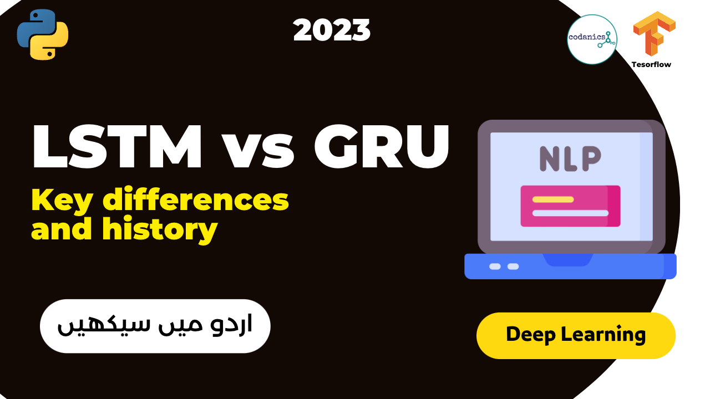](https://youtu.be/RNyuKM1F6JU "Deep Learning")


> Great! You have done a great job in learning Deep Learning. As a token of appreciation, here you have two bonus lectures to increase your skillset.

### **Bonus Lecture: Job Search and Interview Preparation on LinkedIn using chatGPT**

Here is the lecture on Job Search and Interview Preparation:\
[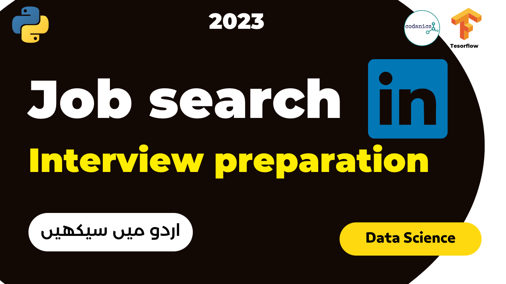](https://youtu.be/xHxYyu_29CQ "Deep Learning")

### **Bonus Lecture: New AI courses on Google by Goolge**

Here is the lecture on New AI courses on Google by Goolge:\
[](https://youtu.be/yLzedg2NGeg "Deep Learning")

> Now, let's move to the Time Series Data Analysis Section.

---
<div align="center" style="background-color:black; padding: 10px; color: yellow; font-size: 10px;">
  
# **Time Series**
  
</div>
---

### **Lecture 01: Introduction to Time Series**

Here is the lecture on Introduction to time series:\
[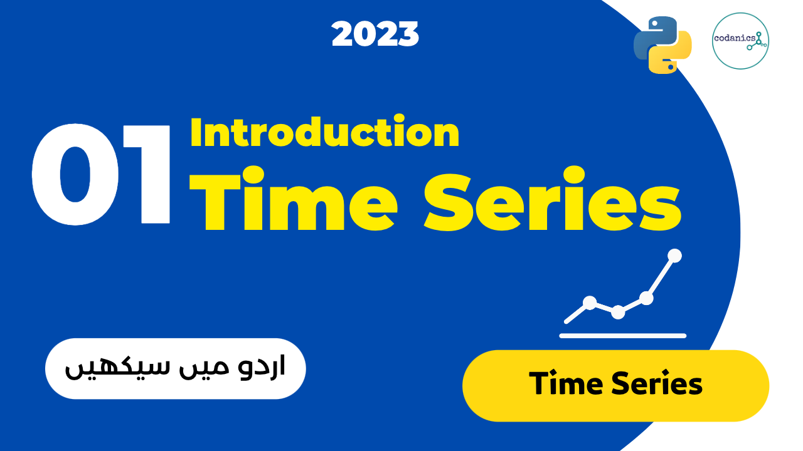](https://youtu.be/jySVZ0CoRho "Time Series")

### **Lecture 02: Types of Data Analysis in Time Series**

Here is the lecture on Types of Data Analysis in Time Series:\
[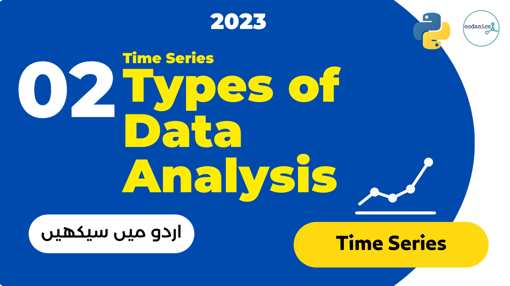](https://youtu.be/pp9l-s_nyVE "Time Series")

### **Lecture 03: Data Types in Time Series**

Here is the lecture on Data Types in Time Series:\
[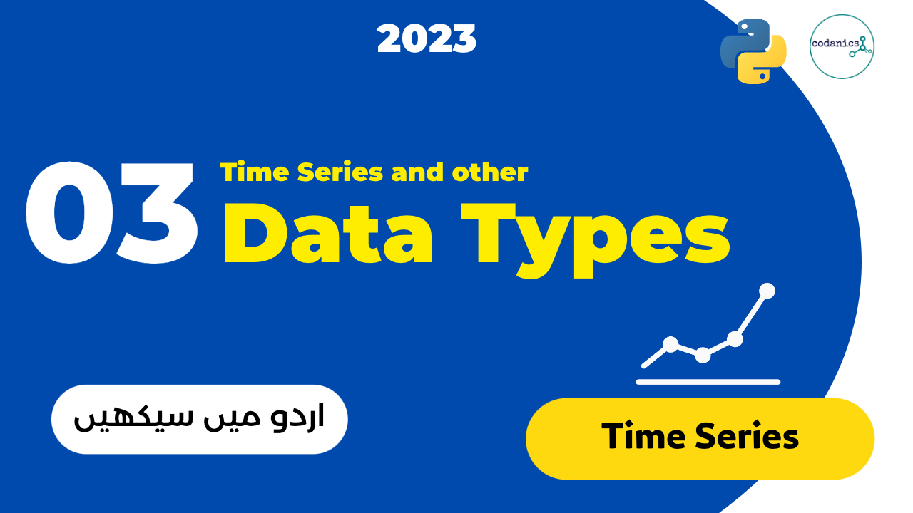](https://youtu.be/OG0G_OMOyKI "Time Series")

### **Lecture 04: Time Series Data Analysis in Python**

Here is the lecture on Time Series Data Analysis in Python:\
[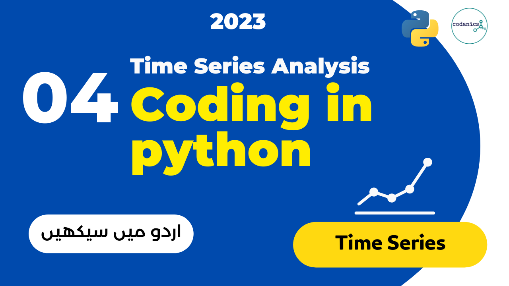](https://youtu.be/VhryowCV-jc "Time Series")

### **Lecture 05: Time Series Project Formation**

Here is the lecture on Time Series Project Formation:\
[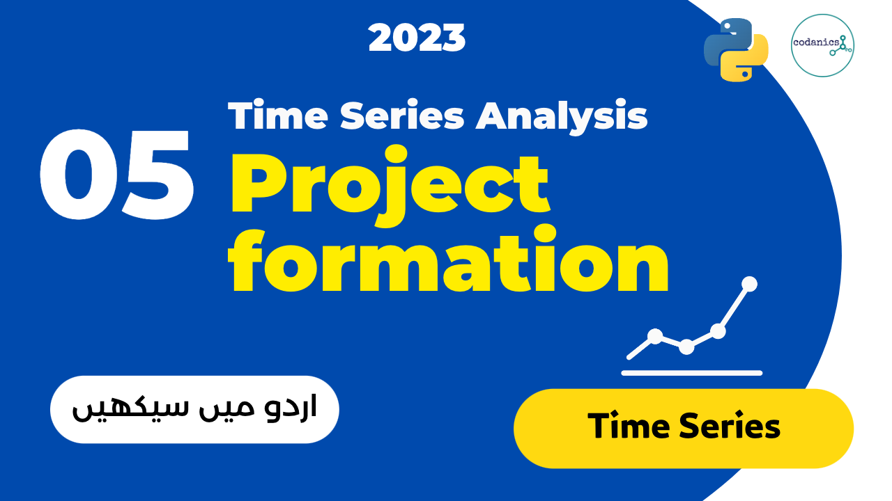](https://youtu.be/vEHJDIHaAmQ "Time Series")

### **Lecture 06: Weather Forecasting Project (Part-1)**

Here is the lecture on Weather Forecasting (Part-1):\
[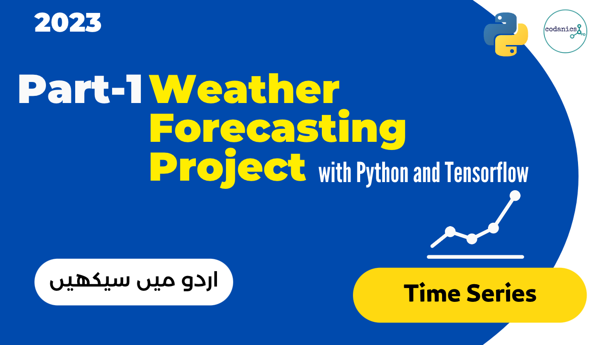](https://youtu.be/XdTa7n_iz9E "Time Series")

### **Lecture 07: Weather Forecasting Project (Part-2)**

Here is the lecture on Weather Forecasting (Part-2):\
[](https://youtu.be/Bv2fIWjVs0o "Time Series")

### **Lecture 08: Weather Forecasting Project (Part-3)**

Here is the lecture on Weather Forecasting (Part-3):\
[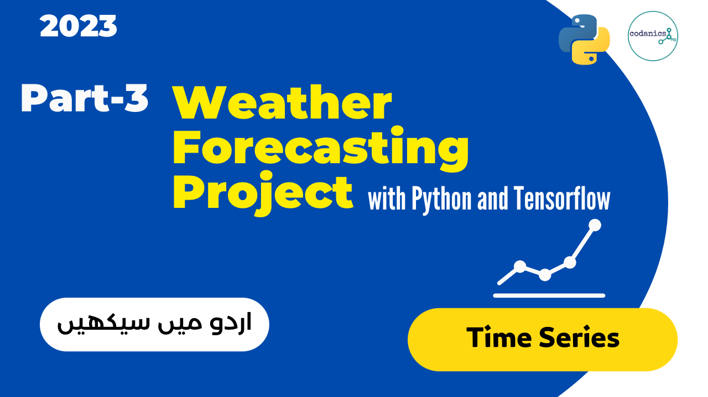](https://youtu.be/xOWuejmnUF8 "Time Series")

### **Lecture 09: Facebook Model - prophet Model (Part-1)**

Here is the lecture on Facebook Model - prophet Model (Part-1):\
[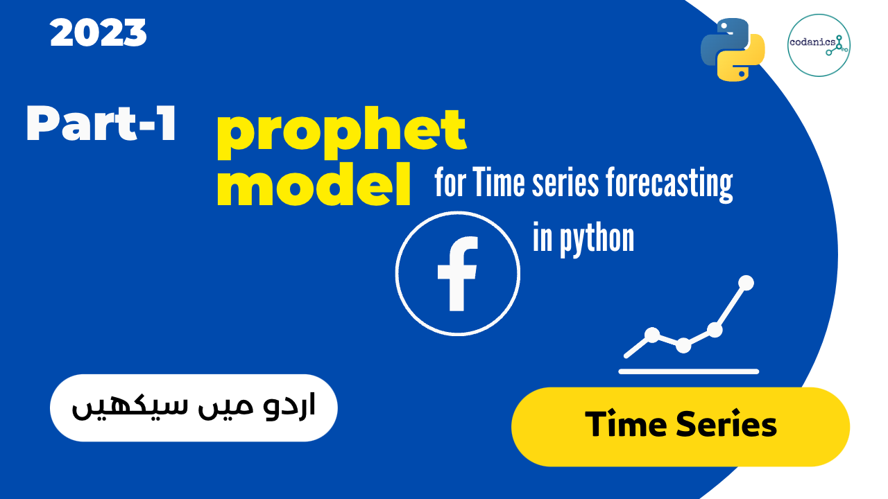](https://youtu.be/DxtDh0cvTTk "Time Series")

### **Lecture 10: Facebook Model - prophet Model (Part-2)**

Here is the lecture on Facebook Model - prophet Model (Part-2):\
[](https://youtu.be/UxUe135XbWk "Time Series")

### **Lecture 11: Webscrapping vs. Webcrawling**

Here is the lecture on Webscrapping vs. Webcrawling:\
[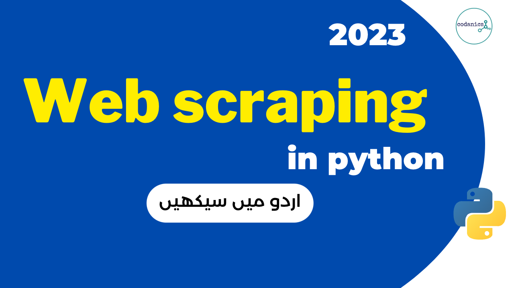](https://youtu.be/ncLc4HSIovk "Time Series")


### **Lecture 12: Webscrapping with Python on wikipedia**

Here is the lecture on Webscrapping with Python on wikipedia:\
[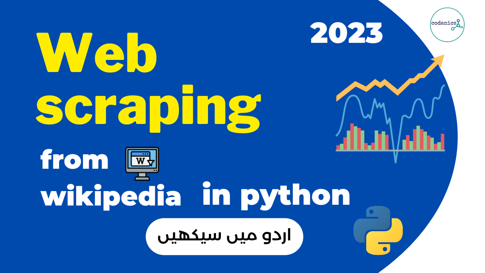](https://youtu.be/7tJFYwLKHQ0 "Time Series")

### **Lecture 13: Stock Market Data Scrapping in Python**

Here is the lecture on Stock Market Data Scrapping in Python:\
[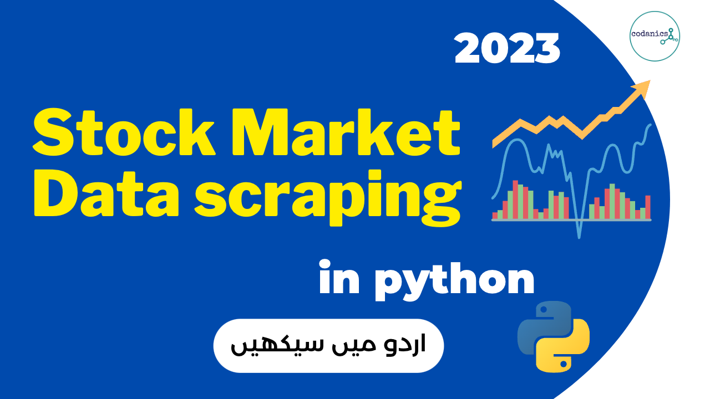](https://youtu.be/74lqfpnsQz8 "Time Series")

### **Lecture 14: ARIMA model in Time Series-Introduction (Part-1)**

ARIMA (Auto Regressive Integrated Moving Average) model in Time Series-Introduction.

Here is the lecture on ARIMA model in Time Series-Introduction (Part-1):\
[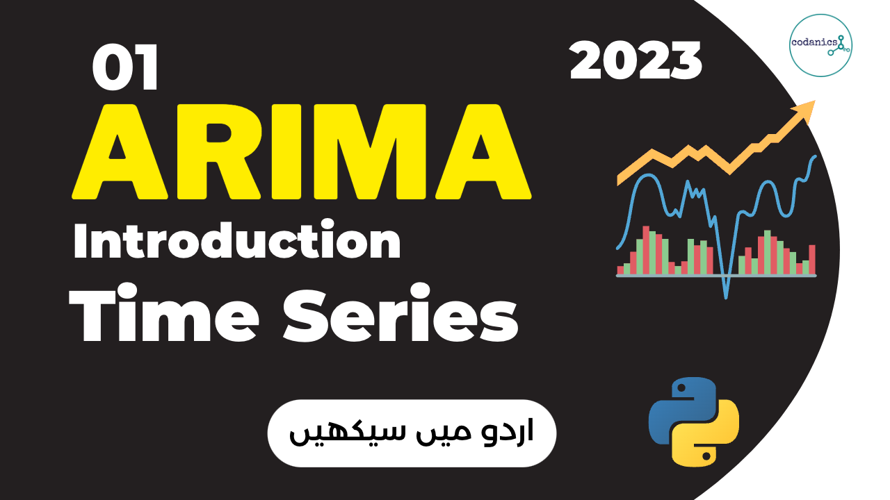](https://youtu.be/GfaYEzGoBUU "Time Series")

### **Lecture 15: ARIMA model python (Part-2)**

Here is the lecture on ARIMA model python (Part-2):\
[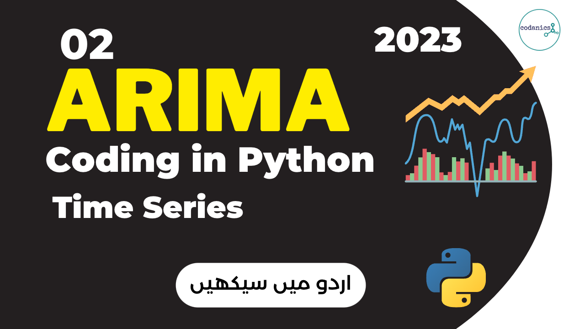](https://youtu.be/Uo6EZQCHJqY "Time Series")

### **Lecture 16: ARIMA model Explained Further (Part-3)**

Here is the lecture on ARIMA model Explained Further (Part-3):\
[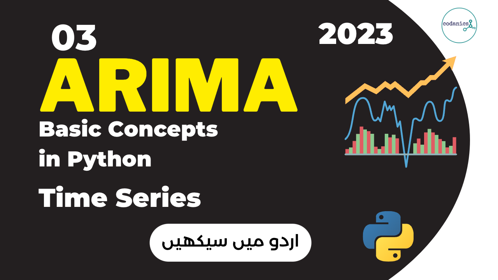](https://youtu.be/4UfKCHjoHIM "Time Series")

### **Lecture 17: Stock Market Forecasting**

Here is the lecture on Stock Market Forecasting:\
[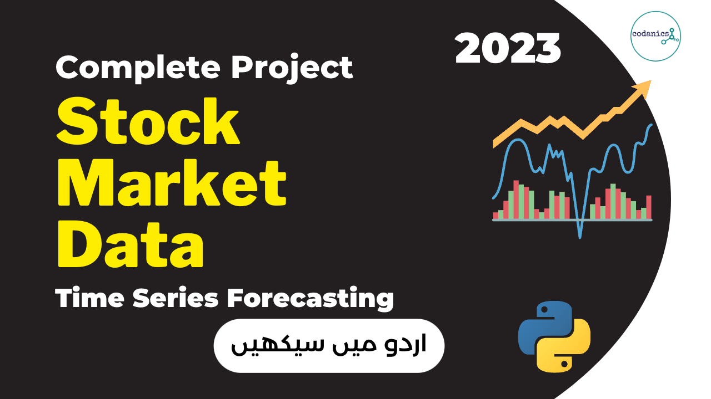](https://youtu.be/ALWt6y7lVWw "Time Series")

### **Lecture 18: Webapplication development using Streamlit**

Here is the lecture on Webapplication development using Streamlit:\
[](https://youtu.be/tRJa_Lpyb1A "Time Series")

### **Lecture 19: Stock Market Data Forecast - A complete Project**

Here is the lecture on Stock Market Data Forecast - A complete Project:\
[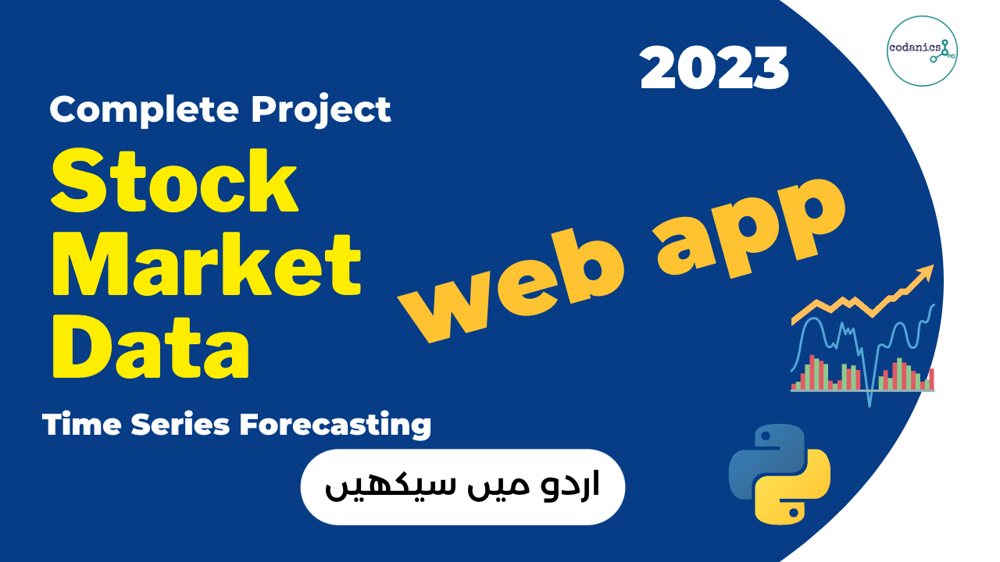](https://youtu.be/jUHbl02inAk "Time Series")

---
<div align="center" style="background-color:black; padding: 10px; color: yellow; font-size: 10px;">

# **openCV and pyTorch**

</div>

### **Lecture 01: Introduction to openCV**

Here is the lecture on Introduction to openCV:\
[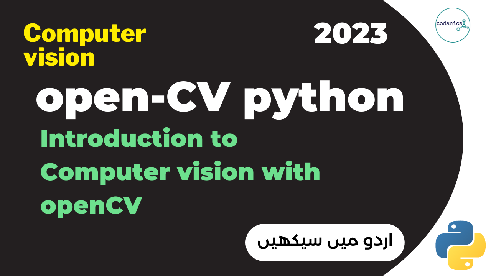](https://youtu.be/pFCf8RbEsoQ "openCV")

### **Lecture 02: Edge Detection in openCV with Python**

Here is the lecture on Edge Detection in openCV with Python:\
[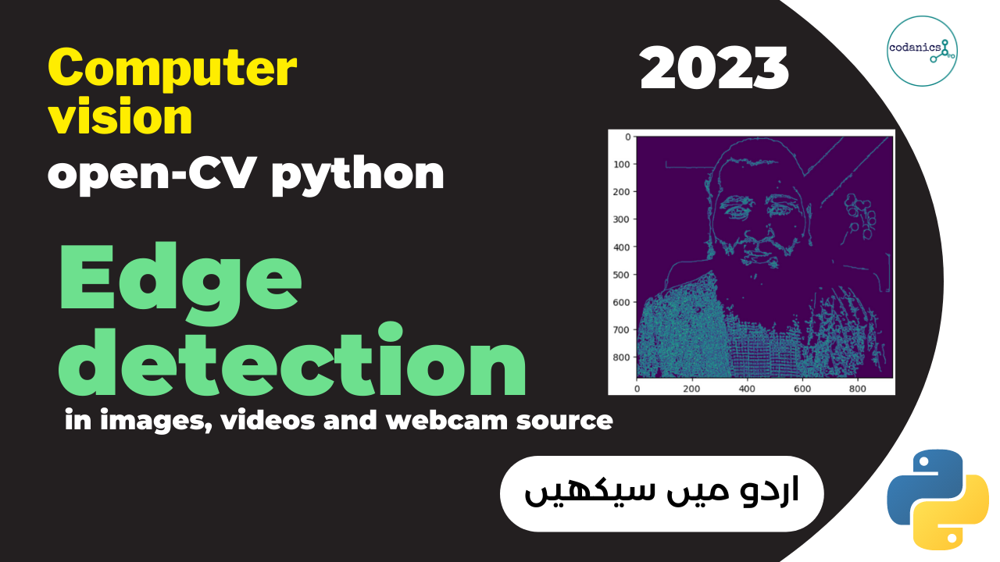](https://youtu.be/RQx8o9gb8TY "openCV")

### **Lecture 03: Face Detection in openCV with Python**

Here is the lecture on Face Detection in openCV with Python:\
[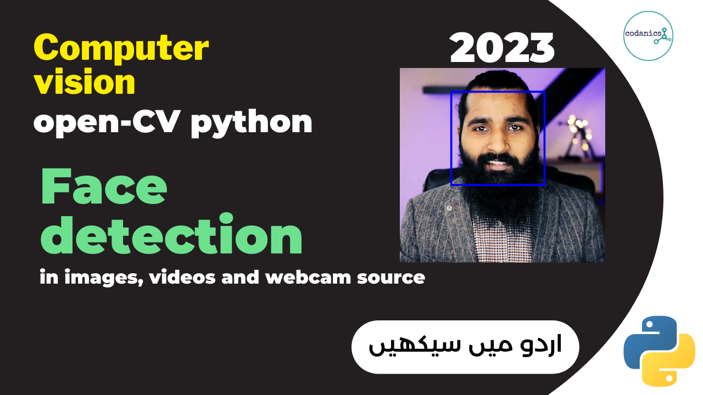](https://youtu.be/C7jOMm2ftKU "openCV")

### **Lecture 04: streamlit webapp using openCV-python- A complete project**

Here is the lecture on streamlit webapp using openCV-python- A complete project:\
[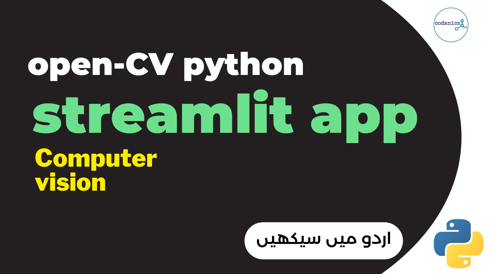](https://youtu.be/4SM4mFOk2Yk "openCV")

### **Lecture 05: Computer Vision Learning Resources**

Here is the lecture on Computer Vision Learning Resources:\
[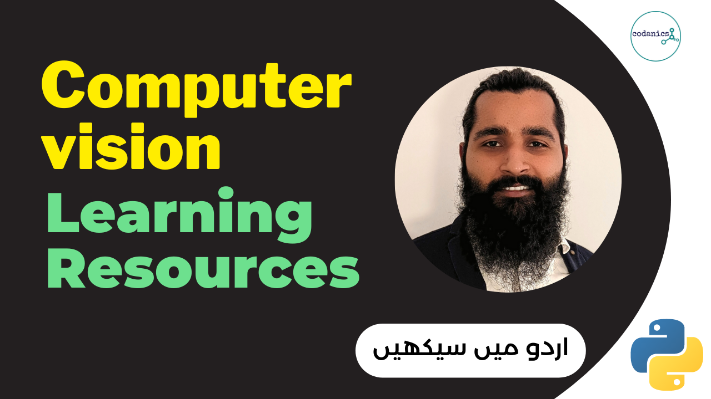](https://youtu.be/rRjTBGDy5Uw "openCV")

### **Lecture 06: Introduction to pyTorch**

Here is the lecture on Introduction to pyTorch:\
[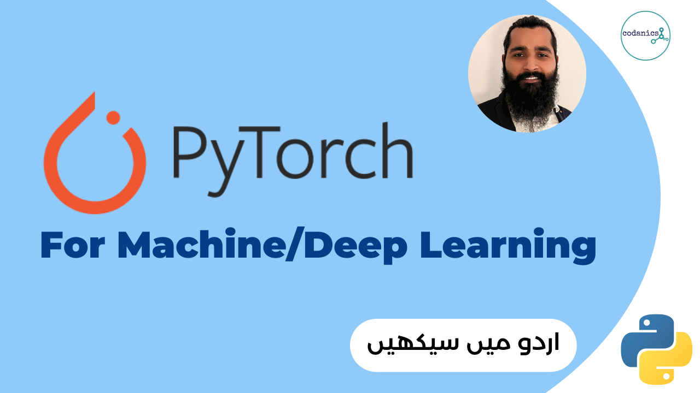](https://youtu.be/4SM4mFOk2Yk "pyTorch")

### **Lecture 07: pyTorch Binary Class Classification using ANN**

Here is the lecture on pyTorch Binary Class Classification using ANN:\
[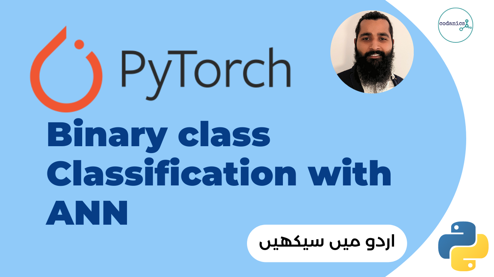](https://youtu.be/Zu_a_IaxcEI "pyTorch")

### **Lecture 08: pyTorch Multi Class Classification using ANN**

Here is the lecture on pyTorch Multi Class Classification using ANN:\
[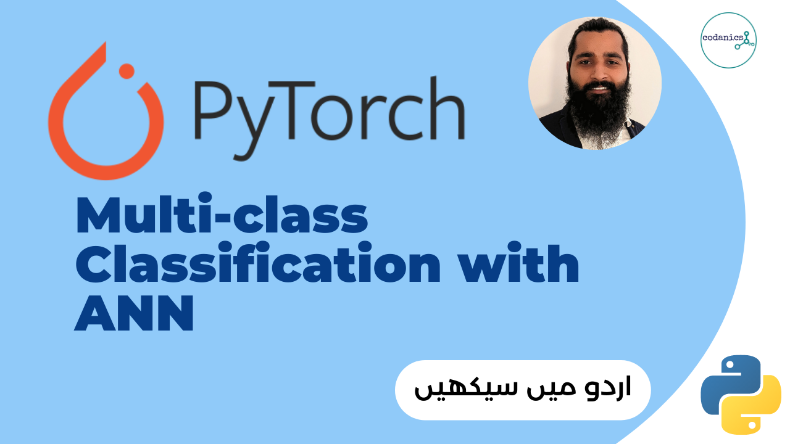](https://youtu.be/eVLSD12PhLo "pyTorch")

### **Lecture 09: pyTorch and DeepLabv3**

Here is the lecture on pyTorch and DeepLabv3:\
[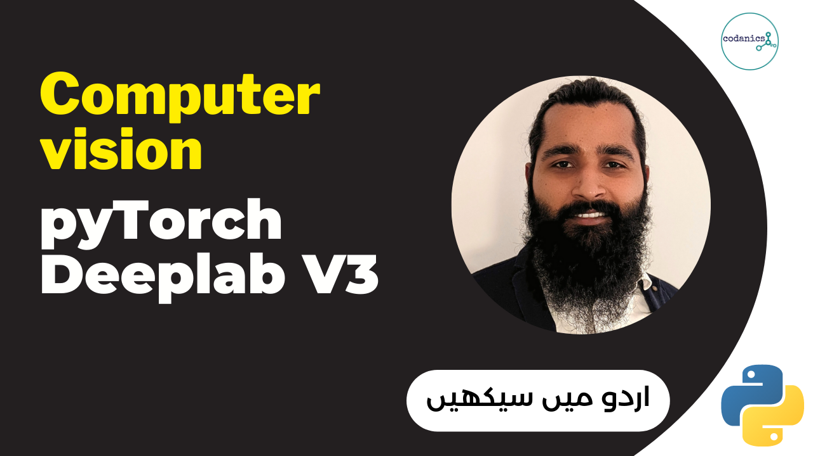](https://youtu.be/QMcE6fQKcJI "pyTorch")

---

<div align="center" style="background-color:black; padding: 10px; color: yellow; font-size: 10px;">

# **langChain and API integration and Generative Models**
</div>

### **Lecture 01: Reinforcement Learning for Langchain and Robotics**

Here is the lecture on Reinforcement Learning for Langchain and Robotics:\
[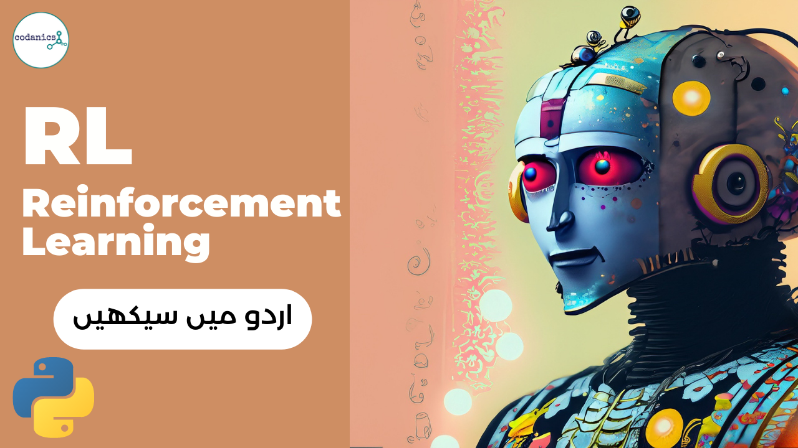](https://youtu.be/nly5e2Fbs4M "RL")

### **Lecture 02: langChain A-Z explained**

Here is the lecture on langChain introduction:\
[](https://youtu.be/vzcFu6ZPS-o "langChain")

### **Lecture 03: langChain app in 14 lines of code**

Here is the lecture on langChain app in 14 lines of code:\
[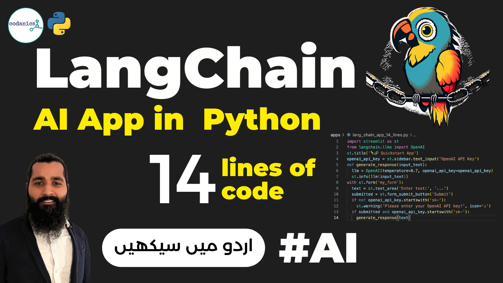](https://youtu.be/1HMo1X84eQM "langChain")

<details><summary><b>Click here to see the code</b></summary>

```python
import streamlit as st
from langchain.llms import OpenAI
st.title('🦜🔗 Quickstart App')
openai_api_key = st.sidebar.text_input('OpenAI API Key')
def generate_response(input_text):
  llm = OpenAI(temperature=0.7, openai_api_key=openai_api_key)
  st.info(llm(input_text))
with st.form('my_form'):
  text = st.text_area('Enter text:', '...')
  submitted = st.form_submit_button('Submit')
  if not openai_api_key.startswith('sk-'):
    st.warning('Please enter your OpenAI API key!', icon='⚠')
  if submitted and openai_api_key.startswith('sk-'):
    generate_response(text)
```
</details>

### **Lecture 04: API integration to make NLP apps**

Here is the lecture on API integration to make NLP apps:\
[](https://youtu.be/edv07U7N2EE "langChain")

### **Lecture 05: chatGPT code interpreter**

Here is the lecture on chatGPT code interpreter:\
[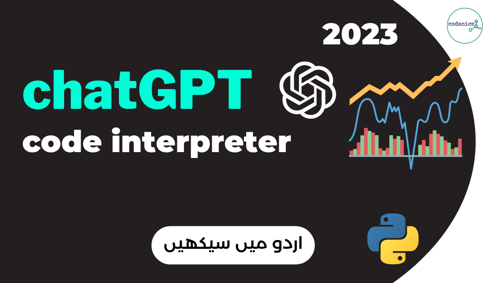](https://youtu.be/tlcCcDCykOw "langChain")

### **Lecture 06: chatPDF application - A complete project**

Here is the lecture on chatPDF application - A complete project:\
[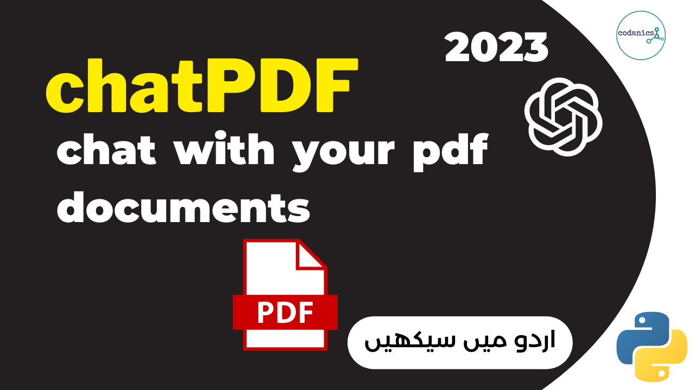](https://youtu.be/bZ7FrgZX2Xw "langChain")

### **Lecture 07: COVID-19 Data Science project Idea - A complete project**

Here is the lecture on COVID-19 Data Science project Idea - A complete project:\
[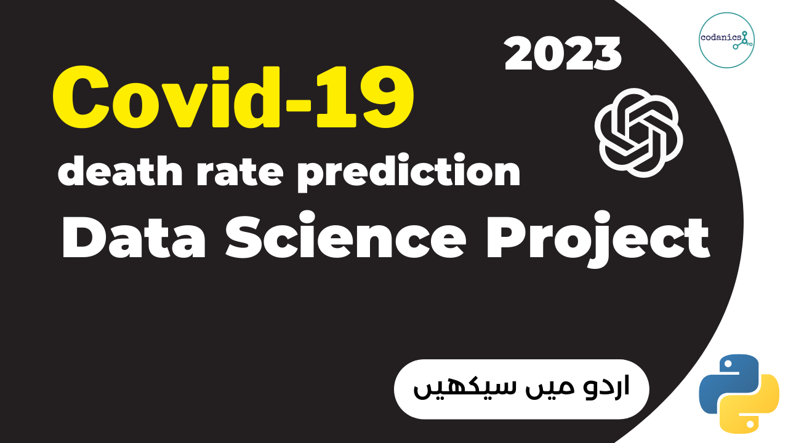](https://youtu.be/cfEtXaE89T4 "langChain")

### **Lecture 08: Generative Models in Python (Stable Diffusion for AI art in Tensorflow**

Here is the lecture on Generative Models in Python (Stable Diffusion for AI art in Tensorflow:\
[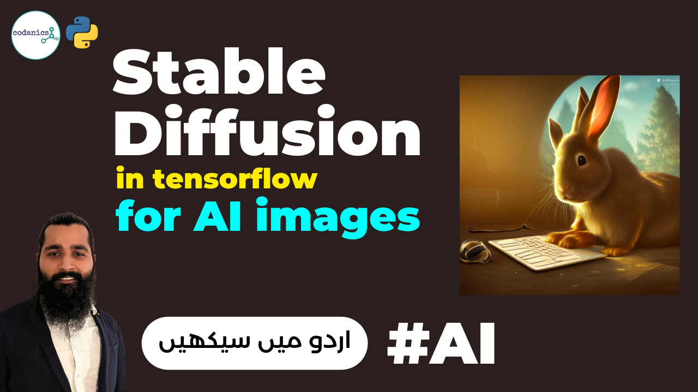](https://youtu.be/psRUFZ9N-bc "Generative Models")

<details><summary><b>Click here to see the code</b></summary>

```python
# !pip install tensorflow keras_cv --upgrade --quiet
import time
import keras_cv
from tensorflow import keras
import matplotlib.pyplot as plt
model = keras_cv.models.StableDiffusion(img_width=512, img_height=512)
images = model.text_to_image(prompt="photograph of an astronaut riding a horse at the beach", 
                             batch_size=3, 
                             num_steps=3, 
                             seed=42,
                             negative_prompt="a painting of a horse")

def plot_images(images):
    plt.figure(figsize=(20, 20))
    for i in range(len(images)):
        ax = plt.subplot(1, len(images), i + 1)
        plt.imshow(images[i])
        plt.axis("off")

plot_images(images)
# save images
for i, img in enumerate(images):
    keras.preprocessing.image.save_img(f"./images/new_image_{i}.jpg", img, scale=True)
```
</details>

---
<div align="center" style="background-color:black; padding: 10px; color: yellow; font-size: 10px;">

# **Ai News Updates**

</div>

I will keep updating this section with latest AI news, so stay tuned.

### **AI News Updates 21st July 2023**

Here is the link to AI News:\
[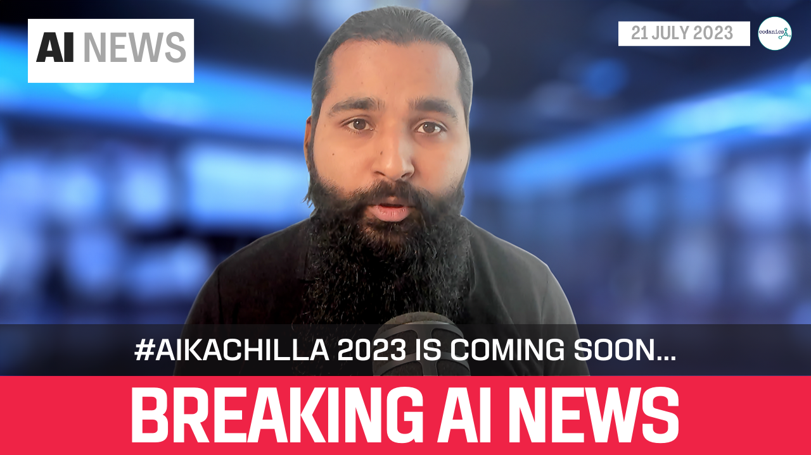](https://youtu.be/sQo2v_HeB-M "AI News")


# YourFeedback and Certificate of Completion:

Did you complete this course and learn most of the things, then let us know via email at info@codanics.com we will give you a certificate of completion (Paid). Ye certificate tab hi milay ga agar ap koi se 10 Porjects complete kar k hamen send karen gay.

# **Join our Facebook Group for more updates:**

[](https://www.facebook.com/groups/codanics/permalink/1872283496462303/)


---
# **Information about the instructor:**

[](https://www.facebook.com/groups/codanics/permalink/1872283496462303/ "Image")


**Dr. Muhammad Aammar Tufail**

PhD Data Science in Agriculture

[](https://www.youtube.com/channel/UCmNXJXWONLNF6bdftGY0Otw/)
[](https://www.linkedin.com/in/dr-muhammad-aammar-tufail-02471213b/)
[](https://github.com/AammarTufail)
[](https://twitter.com/aammar_tufail)
[](https://www.facebook.com/groups/codanics/permalink/1872283496462303/)


For any query

contact: aammar@codanics.com


<!-- pandoc READme.md --from gfm -s --embed-resources --standalone -o READme.html -->