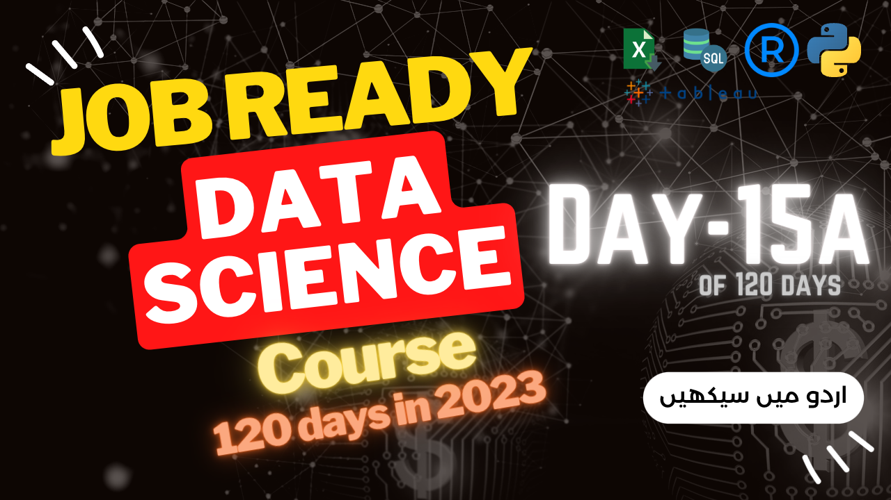
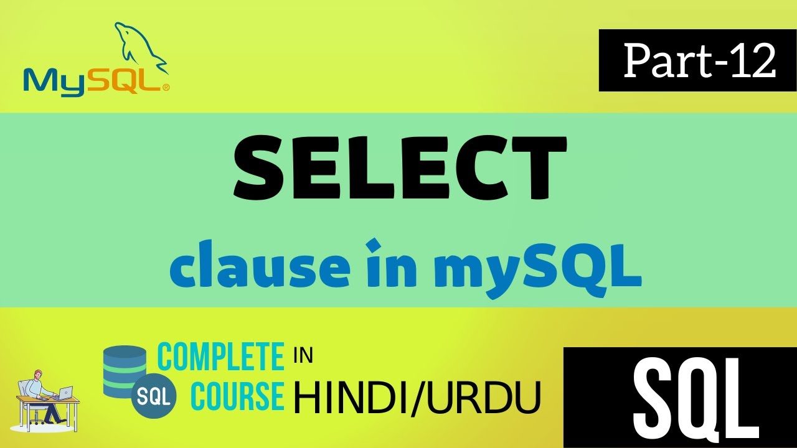

# 120-days of job Ready Data Science Course 
This course is a paid course, if you want to register and join our zoom meeting and online live classes you can [register here](https://forms.gle/aB3VbemahWTxGtGx8)

## Introduction to the course

We will cover follwoing things in this course:

* [Google Data Analytics Professional Certificate](https://www.coursera.org/professional-certificates/google-data-analytics) (completely Taught by Dr. Aammar in Urdu)
* [IBM Data Science Professional Certificate](https://www.coursera.org/professional-certificates/ibm-data-science) (completely Taught by Dr. Aammar in Urdu)
* [DeepLearning.AI TensorFlow Developer Professional Certificate](https://www.coursera.org/professional-certificates/tensorflow-in-practice) (completely Taught by Dr. Aammar in Urdu)
* Everyday post on LinkedIn to polish your portfolio
* Everyday post on Twitter to increase your networking
* Maintain your kaggle account with real life projects
* Fiverr profile update and gigs
* Upwork profile and gigs
* Freelancing tips and tricks
* Job Application guidelines in big companies
* Interview Tips and Tricks
* Mock Interview
* Full of Assignments and Tasks (Real life projects that you need to work on)
* CV Make up for your job
* One to job application guided project
* Content and report writing for Data Science
* Only few people in Team so you can work free and ask questions
* Much more, which will only be disclosed to registered people.

## **Resources**
### *Books* (I will keep updating this list, if you have any book that you think should be added in this list, please let me know via telegram or email)

* [R for Data Science](https://r4ds.hadley.nz/)
* [Statistics for Data Scientists](./resources/books/statistics%20for%20data%20science.pdf)
* [Python for Data Analysis](https://wesmckinney.com/book/)
* [Python Data Science Handbook](https://jakevdp.github.io/PythonDataScienceHandbook/)
* [Hands-On Machine Learning with Scikit-Learn, Keras, and TensorFlow 2nd Edition](./resources/books/Hands-On-Machine-Learning-with-Scikit-Learn-Keras-and-Tensorflow_-Concepts-Tools-and-Techniques-to-Build-Intelligent-Systems-OReilly-Media-2019.pdf)
* [Hands-On Machine Learning with Scikit-Learn, Keras, and TensorFlow 3rd Edition](https://pan.baidu.com/s/1SyPW8cAvoDDNwdaWdN9E0A?pwd=g3ma#list/path=%2F)

## **Lecture No. 0: Pre-requisite of this course:**

Is lecture ko complete kiay bina ap agay nahi chal saken gay is course ko start karne se pehlay ye 11 hours ka lectures zaroor sunen or practice karen, phir agay chalen, warna masla ho ga.

>[Pre-requisite lecture link is here](https://www.youtube.com/live/xjTMkxVSSxg?feature=share)

## **Lecture No. 1: Course plan | Data is Everywhere:**

Here is the complete lecture, click the image and watch the lectrue in Urdu/Hindi.

This lecture explains our strategy in the course and you will learn how you can learn data science job ready skills in upcoming 120 days In Sha Allah.

Click this image to watch the lecture:

## **Lecture No. 2: Introduction to Data Science and importance of Statistics:**

Here is the complete lecture, click the image and watch the lectrue in Urdu/Hindi.

This lecture explains what is data science and what are the skills you need to become a data scientist.

Click this image to watch the lecture:

## **Lecture No. 3: Statistics to Data Science:**

Here is the complete lecture, click the image and watch the lectrue in Urdu/Hindi.

This lecture explains what is statistics and how it is related to data science.

Click this image to watch the lecture:

## **Lecture No. 4: Stat ka zero se start (Complete Workshop):**

This lecture is the complete workshop on statistics for Data Science and tells you basic - advance concepts in Data Science.

This lecture explains why statistics is important for data science.

Click this image to watch the lecture:

## **Lecture No. 5: Introduction to Python and Data Science Revision:**

Here is the complete lecture, click the image and watch the lectrue in Urdu/Hindi.

Please revise this lecture before going to the next step. This lecture was a pre-requisite for the course. Is liay is lecture ko pehlay ap practice karen phir agay chalen, warna maslay masael hun gay.

Click this image to watch the lecture:

## **Lecture No. 6: Statistics for Data Science (Scales of Measurements and details about Data Types):**

Here is the complete lecture, click the image and watch the lectrue in Urdu/Hindi.

This lecture explains the scales of measurements and Data Types in statistics.

Click this image to watch the lecture:

## **Lecture No. 7: Descriptive vs. Inferential  Statistics (Choosing a right statistical Method):**

Here is the complete lecture, click the image and watch the lectrue in Urdu/Hindi.
This lecture explains the Descriptive Statistics in statistics. 

Click this image to watch the lecture:

## **Lecture No. 8: Descriptive and Inferential Statistics:**

Here is the complete lecture, click the image and watch the lectrue in Urdu/Hindi.

> **Part-1**\
Click this image to watch the lecture:

> **Part-2**\
Click this image to watch the lecture:

## **Lecture No. 9: Statistics:**

Here is the complete lecture, click the image and watch the lectrue in Urdu/Hindi.

> **Part-1** Inferential Statistics for Data Science\

> **Part-2** Inferential Statistics for Data Science\

## **Lecture No. 10: Statistics:**

Here is the complete lecture, click the image and watch the lectrue in Urdu/Hindi.

> **Part-1** Hypothesis Testing\

> **Part-2** Important Terms in Statistics\

## **Lecture No. 11: Data Analytics Skills and Job plans:**

Here is the complete lecture, click the image and watch the lectrue in Urdu/Hindi.

## Lecture No. 12: (Revise the Lecture 11) Data Analytics Skills and Job plans:

Here is the complete lecture, click the image and watch the lectrue in Urdu/Hindi.

## **Lecture No. 13: Spreadsheets in Data Science**

We will learn about MS Excel for next few lectures and the lectures will be uploaded here in sequence.

These instructions are a must thing to learn during this MS Excel Series, MS Excel aik bht bara software hy and we can not finish in short time, main ap ko basics sikhaoun ga but you have to learn the advance techniques. Q k har aik company main MS Excel se hi start kia jata hy.

> **Installation**\
> Install MS Excel office 365 free for life time [here](https://www.youtube.com/watch?v=97PIQ3kDl5A)
---

>You also have to practice yourself for MS Excel basics from following online free resources:
>1.  [Learn the basics of MS Excell from here](https://support.microsoft.com/en-us/office/excel-video-training-9bc05390-e94c-46af-a5b3-d7c22f6990bb)
> 2. [Learn Basic to Intermediate MS Excel from here](https://www.linkedin.com/learning/excel-essential-training-microsoft-365-17231101/getting-started-with-excel-for-microsoft-365?autoplay=true)

Here is the complete lecture, click the image and watch the lectrue in Urdu/Hindi.

## **Lecture No. 14: Spreadsheets in Data Science**

The dataset used in this video can be downloaded from [here](./resources/datasets/lecture14.xlsx)

Here is the complete lecture, click the image and watch the lectrue in Urdu/Hindi.

## **Lecture No. 15: Excel Statistics and SQL**

> **Part-1:** In this video you will learn basic statistical analysis in MS Excel Spreadsheet.

Here is the complete lecture, click the image and watch the lectrue in Urdu/Hindi.

> **Part-2:**  **SQL (Structured Query Language) Language**

Here is the complete lecture, click the image and watch the lectrue in Urdu/Hindi.

> [Here is the link to download SQL Cheat sheet](./resources/cheat_sheets/SQL-cheat-sheet.pdf)

## **Lecture No. 16: SQL**

> **Part-1:**  **SQL (Structured Query Language) Language- Introduction**

Here is the complete lecture, click the image and watch the lectrue in Urdu/Hindi.

> **Part-2:**  **SQL (Structured Query Language) Language Introduction**

Here is the complete lecture, click the image and watch the lectrue in Urdu/Hindi.

> **Part-3:**  **SQL Software installation**
- Download:\
[Here is the link to download mySQL](https://www.mysql.com/downloads/)

Here is the complete lecture, click the image and watch the lectrue in Urdu/Hindi.

> **Part-4:**  **How to create SQL database?**

Here is the complete lecture, click the image and watch the lectrue in Urdu/Hindi.

> **Part-5:**  **How to create SQL table?**

Here is the complete lecture, click the image and watch the lectrue in Urdu/Hindi.

## **Lecture No. 17: SQL intermediate**

> **Part-1:**  **Distinct Function in mySQL**

Here is the complete lecture, click the image and watch the lectrue in Urdu/Hindi.

> **Part-2:**  **Constraints in mySQL**

Here is the complete lecture, click the image and watch the lectrue in Urdu/Hindi.

> **Part-3:**  **Auto-increament in mySQL**

Here is the complete lecture, click the image and watch the lectrue in Urdu/Hindi.

> **Part-4:**  **mySQL workbench first look**

Here is the complete lecture, click the image and watch the lectrue in Urdu/Hindi.

> **Part-5:**  **Import mySQL database in mySQL workbench**

Here is the complete lecture, click the image and watch the lectrue in Urdu/Hindi.

## **Lecture No. 18: SQL intermediate**

> **Part-1:**  **Pandas procerssing on mySQL database**

Here is the complete lecture, click the image and watch the lectrue in Urdu/Hindi.

> **Part-2:**  **SELECT clause in mySQL**

Here is the complete lecture, click the image and watch the lectrue in Urdu/Hindi.

> **Part-3:**  **Data Manipulation in mySQL**

Here is the complete lecture, click the image and watch the lectrue in Urdu/Hindi.

> **Part-4:**  **Where Clause and Comparison operators in mySQL**

Here is the complete lecture, click the image and watch the lectrue in Urdu/Hindi.

> **Part-5:**  **AND NOT OR IN in mySQL**

Here is the complete lecture, click the image and watch the lectrue in Urdu/Hindi.

## **Lecture No. 19: SQL intermediate**

> **BETWEEN clause in mySQL**

Here is the complete lecture, click the image and watch the lectrue in Urdu/Hindi.

## **Lecture No. 20: SQL Practice**

> **mySQL Practice**

**Remember to pratice from this [website Link](https://www.w3schools.com/mysql/default.asp)** **for more practice.**

## **Lecture No. 21: R and R studio**

Aaj se ham R and RStudio per kaam karna start karen gay. Sab se pehlay ap log following software install kar len:

- **R** downlpoad and install from [here](https://cran.r-project.org/bin/windows/base/)
- Rstudio download and install from [here](https://rstudio.com/products/rstudio/download/#download) 

>Software install karne k baad aaaj se ham `R` or `Rstudio` ko Data Analaysis k tasks k liay use karne walay hyn agar ap tez speed per seekhna chahtay hyn tu is [playlist se R with Aammar](https://youtube.com/playlist?list=PL9XvIvvVL50F4aFhWp_drvP3XkQCHx2MU) seekh len, warna ham tu anay walay lectures main sikha hi den gay ap ko. 

Click the image to watch the lecture in Urdu/Hindi.

Click the image to watch the complete playlist of R with Aammar in Urdu/Hindi.

## **Lecture No. 22: R and R studio**

Click the image to watch the lecture in Urdu/Hindi.

## **Lecture No. 23: R and R studio**

### **Lecture 23a: Installation of Software and Introduction to R**
- Click this image to watch the lecture\

### **Lecture 23b: First Line of Code in R and learning to work with R**
- Click this image to watch the lecture\

### **Lecture 23c: Data Visualization and plotting in R using ggplot2**
- Click this image to watch the lecture\

### **Lecture 23d: Data Visualization and Data Transformation in R using tidyverse packages**
- Click this image to watch the lecture\

### **Publication Ready Graphs in R**
Wathc these two Playlist to learn Data Visualization in R in Desi style:

1. [Publication Ready Graphs in R](https://www.youtube.com/playlist?list=PL9XvIvvVL50Hi2RGu-zlNEnk9WJMjPH-g)
2. [Many plots in R](https://www.youtube.com/playlist?list=PL9XvIvvVL50HUjcRuTd5eC-EMA9picnVz)

## **Lecture No. 24: R and R studio**

### **Lecture 24a: Data Transformation in R using tidyverse packages**
- Click this image to watch the lecture\

>**Cheat sheet**\
>Practice this cheatsheet today and then move to next point tomorrow.\
>[Link to dplyr cheatsheet is here](https://www.rstudio.com/wp-content/uploads/2015/02/data-wrangling-cheatsheet.pdf "dplyr cheatsheet")

### **Lecture 24b: Statistics in R**
- Click this image to watch the lecture\

The following links were taught in this lecture:
1. [How to test Normal Distribution in R?](https://www.statology.org/test-for-normality-in-r/)
2. [How to make correlation plot in R?](https://cran.r-project.org/web/packages/corrplot/vignettes/corrplot-intro.html)
3. [How to make PCA plot in R](https://www.youtube.com/watch?v=q9757Bz8Mdw&list=PL9XvIvvVL50HUjcRuTd5eC-EMA9picnVz&index=1&t=1s)
4. [Here is a nice publication about choosing a right statistical method](https://www.ncbi.nlm.nih.gov/pmc/articles/PMC6639881/#:~:text=Selection%20of%20appropriate%20statistical%20method,observations%20(paired%2Funpaired).)

### **Lecture 24c: Choosing a right Statistical Method for Data Analysis in R**

- Click this image to watch the lecture\

[Here is the code that we used today](https://github.com/AammarTufail/R_with_Aammar/blob/main/Publication_Ready_Figures/03-ggpubr/03-ggpubr-readme-.md)

### **Lecture 24d: t-test (all Types), ANOVA, One-way ANOVA, Two-way ANOVA, lettering and plotting in R**

- Click this image to watch the lecture\

Here are the codes we discussed in this lecture:
1. RScript used in this lecture:
   1. [t-test script](resources/t-test.R)
   2. [ANOVA](resources/anova.R)
2. [t-test blog](https://data-flair.training/blogs/t-tests-in-r/#:~:text=What%20is%20T%2Dtests%20in%20R%20Programming%3F,normal%20distributions%20with%20equal%20variances.)
3. [One-way ANOVA in R complete blog](https://statsandr.com/blog/anova-in-r/)
4. [Two-way ANOVA in R complete blog](https://www.agroninfo.com/two-way-analysis-of-variance-in-r/)

### **Lecture 24e: Publication Ready Plots in R**

1. Publication Ready Bar plot with one-way ANOVA and lettering in R:

> Here is the code: [code.md](https://github.com/AammarTufail/R_with_Aammar/blob/main/Publication_Ready_Figures/06-%20Publication-ready-Barplots/06--Publication-ready-Barplots.md)

2. Publication Ready Bar plot with two-way ANOVA and lettering in R:

> Here is the code: [code.md](https://github.com/AammarTufail/R_with_Aammar/blob/main/Publication_Ready_Figures/07-%20two_way_ANOVA_barplots/07-two_way_ANOVA_barplot_with_lettering.md)

### **Lecture 25: EDA in R**

Here is the lecture on EDA day 25:\

### **Lecture 26: EDA in R**

Here is the detailsed code to practice in R, please follow the steps and perform the EDA analysis, this will also show you that how efficient and accurate you are using R for EDA analysis.\
Here is the link to the code file r script: [code.md](./resources/codes/eda_basics.R) copy or download this file and practice the EDA analysis in R.\

### **Lecture 27: EDA in R a project**

Here is the lecture on EDA day 27:\

### **Lecture 28: EDA in R a project**

Here is the lecture on EDA day 28:\

---
# **Information about the instructor:**

**Dr. Muhammad Aammar Tufail**

PhD Data Science in Agriculture

For any query

contact: aammar@codanics.com